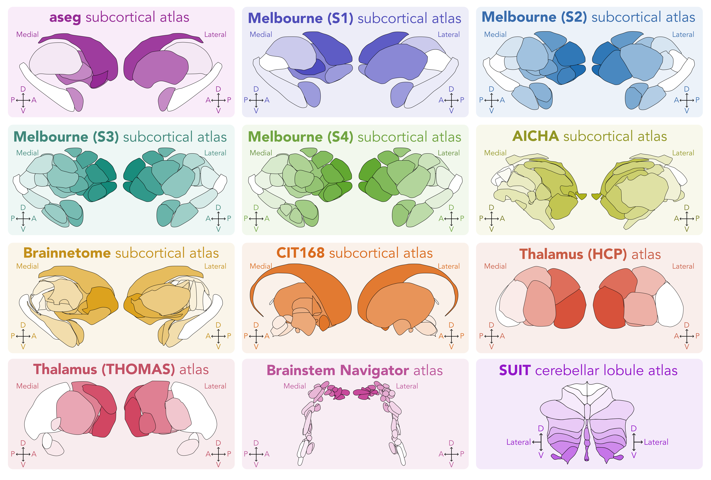
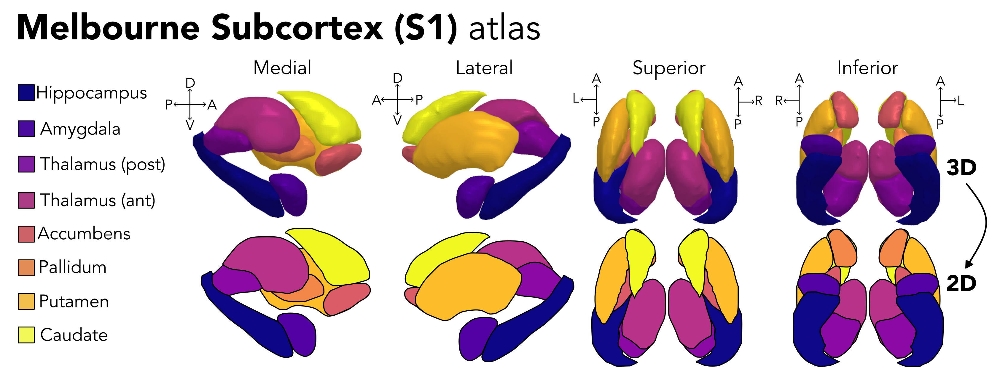
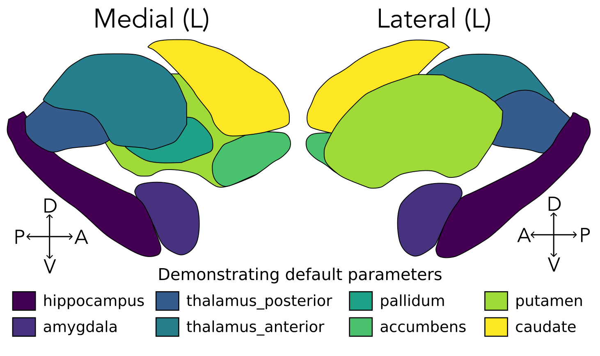
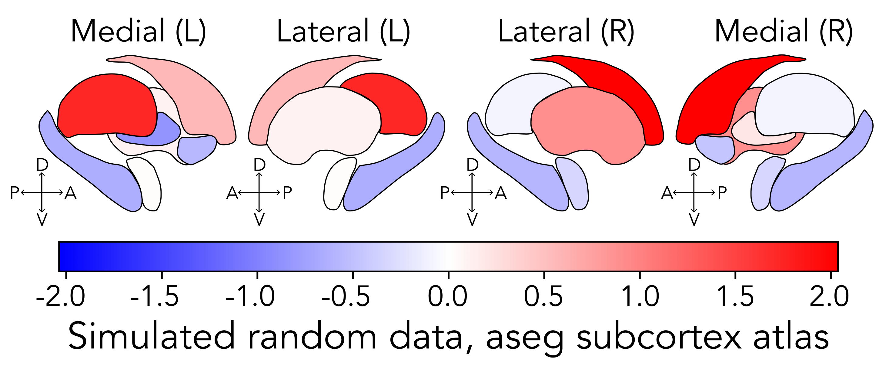
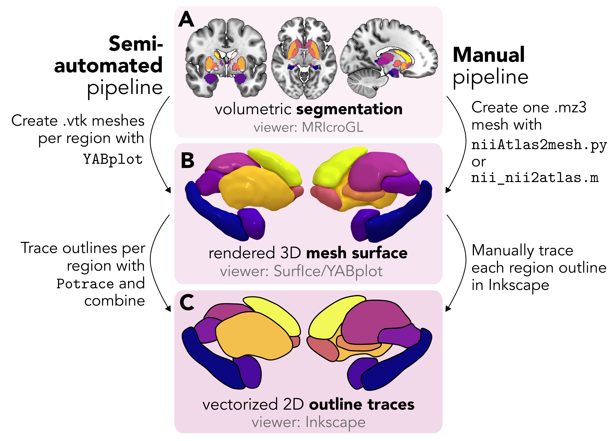

# subcortex_visualization: A toolbox for custom data visualization in the subcortex and cerebellum

[](https://doi.org/10.64898/2026.01.23.699785)

This package (implemented in Python and R) currently includes the following twelve subcortical and cerebellar atlases for data visualization in two-dimensional vector graphics:



More information about these atlases, including the process of rendering the surfaces and tracing the outlines for each, can be found in the [`atlas_info/`](https://github.com/anniegbryant/subcortex_visualization/tree/main/atlas_info) directory and at the [project website](https://anniegbryant.github.io/subcortex_visualization/).

## 🙋‍♀️ Motivation

If you work with subcortical or cerebellar data, you've probably hit this wall: there are plenty of beautiful tools for visualizing cortical results (as elegantly laid out by [Chopra et al. *Aperture Neuro* 2023](https://apertureneuro.org/article/85104-a-practical-guide-for-generating-reproducible-and-programmatic-neuroimaging-visualizations)), but far fewer options by comparison once you venture below the cortical mantle. 
Most research groups end up building their own one-off plotting pipelines per atlas, which often amounts to lot of duplicated effort and figures that are hard to compare across studies.

This package takes inspiration from the fantastic [`ggseg`](https://github.com/ggseg/ggseg) R package (and its [Python extension](https://github.com/ggseg/python-ggseg/)), which unifies cortical atlas visualization into clean, standardized 2D vector plots. 
We admire this approach for a few reasons: vector graphics aren't subject to the lighting artifacts that make 3D renderings tricky to interpret (especially with color-mapped values), and they produce crisp, resolution-independent figures that are publication-ready straight out of the box (and easy to touch up in Inkscape or Illustrator afterwards).

While `ggseg` does support subcortical plotting via the FreeSurfer `aseg` atlas, it's [not currently possible](https://github.com/ggseg/ggseg/issues/104) to show all seven subcortical regions (accumbens, amygdala, caudate, hippocampus, pallidum, putamen, thalamus) together in one figure, and the atlas coverage for the broader subcortex, thalamic nuclei, brainstem, and cerebellum is quite limited across the field.

`subcortex_visualization` is our attempt to fill that gap: twelve commonly used non-cortical atlases, all in the same consistent 2D vector format, with a single function call in Python or R. 
To our knowledge, it's the largest collection of non-cortical atlases in one unified vector-based visualization toolbox.

The below graphic shows the journey from 3D volumetric segmentation to 2D vector scaffold, using the [Melbourne Subcortex Atlas](https://github.com/yetianmed/subcortex/tree/master) (S1 resolution) as an example:



Vector outlines are derived from three-dimensional subcortical meshes (like the one for the aseg atlas offered by the [ENIGMA toolbox](https://github.com/MICA-MNI/ENIGMA)), either through a semi-automated or manual tracing pipeline.
Check out [`adding_new_atlases/`](https://github.com/anniegbryant/subcortex_visualization/tree/main/adding_new_atlases) as well as the [package documentation website](https://anniegbryant.github.io/subcortex_visualization/custom_segmentation) for more information.
Those same pipelines are there for you if you want to add your own custom atlas to the mix.

## 🖥️ Installation

### Python 

The Python version of this package can be installed in two ways.
First, you can install directly with pip from the [PyPI repository](https://pypi.org/project/subcortex-visualization/):

```bash
pip install subcortex-visualization
```

If you would like to make your own modifications before installing, you can also clone this repository first and then install from your local version:

```bash
git clone https://github.com/anniegbryant/subcortex_visualization.git
cd subcortex_visualization
pip install .
```

This will install the `subcortex_visualization` package so you have access to the `plot_subcortical_data` function and associated data.

### R

The R version of this package can be installed from GitHub within R using the `remotes` package as follows:

```R
# if not already installed
install.packages("remotes")

# then install subcortexVisualizationR
remotes::install_github("anniegbryant/subcortex_visualization", subdir = "subcortexVisualizationR")
```

## 👨‍💻 Usage

### ❗️ Quick start

Running the code below (in either Python or R) will produce an image of the left subcortex in the `aseg_subcortex` atlas (the default), each region colored by its index, with the viridis color scheme:

```python
plot_subcortical_data(hemisphere='L', fill_title="Subcortical region index", atlas='Melbourne_S1')
```



Note that we specified `atlas='Melbourne_S1'` to demonstrate default functionality with the S1 resolution of the Melbourne Subcortex Atlas.


### 📚 Tutorial

For a guide that goes through all the functionality and atlases available in this package, we compiled walkthrough tutorials for [Python](https://anniegbryant.github.io/subcortex_visualization/python_tutorial/) and [R](https://anniegbryant.github.io/subcortex_visualization/R_tutorial/) on the project website.
To plot real data in the subcortex, your `subcortex_data` should be a Python `pandas.DataFrame` or an R `data.frame` structured as follows (here we've just assigned an integer index to each region):

| region        | value         | Hemisphere  |
| :--- | :---: | :---: |
| accumbens | 0 | L |
| amygdala | 1 | L |
| caudate | 2 | L |
| hippocampus | 3 | L |
| pallidum | 4 | L |
| putamen | 5 | L |
| thalamus | 6 | L |

The core plotting function in both Python and R is `plot_subcortical_data`, which takes the following arguments:

| Parameter | Default | Description |
|-----------|---------|-------------|
| `subcortex_data` | `None` / `NULL` | Optional dataframe with columns `region`, `Hemisphere`, and `value_column`. If omitted, regions are colored by index. |
| `atlas` | `'aseg_subcortex'` | Atlas name (see full list below). |
| `value_column` | `'value'` | Column in `subcortex_data` to visualize. |
| `hemisphere` | `'L'` | `'L'`, `'R'`, or `'both'`. |
| `views` | `['medial', 'lateral']` | Which faces to show. Options: `'medial'`, `'lateral'`, `'superior'`, `'inferior'`. Not applicable to SUIT. |
| `line_color` | `'black'` | Outline color for each region. |
| `line_thickness` | `0.5` | Outline thickness, or a column name in `subcortex_data` for per-region thickness. |
| `cmap` | `'viridis'` | Colormap name, a `matplotlib.colors.Colormap`, or (in R) a vector of hex colors or palette function. |
| `NA_fill` | `'#cccccc'` | Fill color for regions with missing data. |
| `fill_alpha` | `1.0` | Region opacity (0–1). |
| `fill_by_significance` | `False` / `FALSE` | If `True`, dims non-significant regions (requires a `p_value` column in `subcortex_data`). |
| `nonsig_fill_alpha` | `0.5` | Opacity for non-significant regions when `fill_by_significance=True`. |
| `vmin` / `vmax` | `None` / `NULL` | Manually constrain the colormap range. |
| `midpoint` | `None` / `NULL` | Center a diverging colormap at this value. |
| `show_legend` | `True` / `TRUE` | Whether to display the colorbar/legend. |
| `fill_title` | `'values'` | Colorbar label. |
| `fontsize` | `12` | Font size for figure text. |

Two additional utility functions are also available.
Check out the full [Python API](https://anniegbryant.github.io/subcortex_visualization/api_reference/) or [R API](https://anniegbryant.github.io/subcortex_visualization/R_api/) reference:

* `parcel_segstats`: Extract and summarize voxel values from a NIfTI volume across atlas parcels (supports multiple atlases and summary statistics, with optional resampling).
* `get_atlas_regions`: Return the region names for a given atlas.

Here's an example in Python for plotting both hemispheres with data randomly sampled from a normal distribution, using a blue–white–red diverging colormap centered at zero:

```python
import matplotlib.colors as mcolors
import numpy as np

np.random.seed(127)

# Get region names for the aseg subcortex atlas
aseg_subcortex_regions = get_atlas_regions("aseg_subcortex")

# Sample random values from a normal distribution for each hemisphere
example_continuous_data_L = (pd.DataFrame({
    "region": aseg_subcortex_regions,
    "value": np.random.normal(0, 1, len(aseg_subcortex_regions))
}).assign(Hemisphere="L"))

example_continuous_data_R = (pd.DataFrame({
    "region": aseg_subcortex_regions,
    "value": np.random.normal(0, 1, len(aseg_subcortex_regions))
}).assign(Hemisphere="R"))

# Combine left and right hemisphere data for bilateral plotting
example_continuous_data = pd.concat([example_continuous_data_L, example_continuous_data_R], axis=0)

white_blue_red_cmap = mcolors.LinearSegmentedColormap.from_list("BlueWhiteRed", ["blue", "white", "red"])

plot_subcortical_data(subcortex_data=example_continuous_data, atlas='aseg_subcortex',
                      hemisphere='both', fill_title="Normal distribution sample",
                      cmap=white_blue_red_cmap, midpoint=0)
```



### 🗺️ Available atlases

The following subcortical and cerebellar atlases are currently supported with more information at the [project website](https://anniegbryant.github.io/subcortex_visualization/atlas_info/): 

* `aseg_subcortex`: The `aseg` parcellation atlas from FreeSurfer
* `Melbourne_S1`: The Melbourne Subcortex Atlas at granularity level S1, from [Tian et al. *Nature Neuroscience* (2020)](https://www.nature.com/articles/s41593-020-00711-6)
* `Melbourne_S2`: The Melbourne Subcortex Atlas at granularity level S2, from [Tian et al. *Nature Neuroscience* (2020)](https://www.nature.com/articles/s41593-020-00711-6)
* `Melbourne_S3`: The Melbourne Subcortex Atlas at granularity level S3, from [Tian et al. *Nature Neuroscience* (2020)](https://www.nature.com/articles/s41593-020-00711-6)
* `Melbourne_S4`: The Melbourne Subcortex Atlas at granularity level S4, from [Tian et al. *Nature Neuroscience* (2020)](https://www.nature.com/articles/s41593-020-00711-6)
* `AICHA_subcortex`: The AICHA subcortex atlas, from [Joliot et al. *J Neurosci Methods* (2015)](https://pubmed.ncbi.nlm.nih.gov/26213217/)
* `Brainnetome_subcortex`: The Brainnetome subcortex atlas, from [Fan et al. *Cerebral Cortex* (2016)](https://pmc.ncbi.nlm.nih.gov/articles/PMC4961028/)
* `CIT168_subcortex`: The CIT168 reinforcement learning atlas, from [Pauli et al. *Scientific Data* (2018)](https://www.nature.com/articles/sdata201863)
* `Thalamus_HCP`: The thalamic nuclei atlas derived from HCP data, from [Najdenovska et al. *Scientific Data* (2018)](https://www.nature.com/articles/sdata2018270)
* `Thalamus_THOMAS`: The THOMAS thalamic nuclei atlas, from [Su et al. *NeuroImage* (2019)](https://pmc.ncbi.nlm.nih.gov/articles/PMC6536348/)
* `Brainstem_Navigator`: The Brainstem Navigator atlas, from [Bianciardi et al. *Brain Connectivity* (2015)](https://pmc.ncbi.nlm.nih.gov/articles/PMC4684653/)
* `SUIT_cerebellar_lobule`: The SUIT cerebellum atlas, from [Diedrichsen *Neuroimage* (2006)](https://doi.org/10.1016/j.neuroimage.2006.05.056)

## 💡 Want to generate your own mesh and/or parcellation?



This package provides twelve subcortical, thalamic, and cerebellar atlases as a starting point.
The workflow can readily be extended to your favorite segmentation atlas, though!
We provide two pipelines in the [`adding_new_atlases/`](https://github.com/anniegbryant/subcortex_visualization/tree/main/adding_new_atlases) folder:

1. **Semi-automated pipeline**: Uses Python scripts to automatically trace per-region surface meshes via [YABplot](https://github.com/teanijarv/yabplot) and [Potrace](http://potrace.sourceforge.net/); faster and fully scriptable for atlases with clearly separable regions.
2. **Manual pipeline**: Interactively renders a composite mesh in [Surf Ice](https://github.com/neurolabusc/surf-ice) and traces each region by hand in [Inkscape](https://inkscape.org/); more time-consuming, but more interactive and offers finer control for atlases with many small or closely-packed nuclei.

Check out the [project website page](https://anniegbryant.github.io/subcortex_visualization/custom_segmentation/) for a full walkthrough of both approaches.

## 🔗 Citing this package

If you use this package in a scientific publication, blog post, etc., we ask that you please read and cite the [associated preprint](https://www.biorxiv.org/content/10.64898/2026.01.23.699785):

* 📕 Bryant, Annie G. (2026). Subcortex visualization: A toolbox for custom data visualization in the subcortex and cerebellum. *bioRxiv*, 2026-01. doi:10.64898/2026.01.23.699785.

<details closed>
    <summary>Click here for a BibTex reference:</summary>

```
@article{bryant2026subcortex,
	title = {Subcortex visualization: A toolbox for custom data visualization in the subcortex and cerebellum},
	url = {https://www.biorxiv.org/content/10.64898/2026.01.23.699785},
	doi = {10.64898/2026.01.23.699785},
	journal = {bioRxiv},
  publisher={Cold Spring Harbor Laboratory},
	author = {Bryant, Annie G.},
  pages = {2026--01},
	year = {2026}
}
```

</details>

## 🙏 Acknowledgments

Thank you very much to [Sidhant Chopra](https://github.com/sidchop), [Chris Rorden](https://github.com/rordenlab), [Justine Hansen](https://github.com/justinehansen), and [Ye Tian](https://github.com/yetianmed) for their suggestions and continued development of open tools for neuroimaging visualization that enabled the development of this project!

We're also very grateful for ongoing contributions from members of the GitHub community: 

[](https://github.com/anniegbryant/subcortex_visualization/graphs/contributors)

## Publications that have used this package 👯‍♀️

📜 Diano et al. (2025) *PNAS*: https://www.pnas.org/doi/10.1073/pnas.2518549122
 
📜 Wu et al. (2026) *NeuroImage*: https://www.sciencedirect.com/science/article/pii/S1053811926000315


## ❓📧 Questions, comments, or suggestions always welcome!

Please feel free to ask questions, report bugs, or share suggestions by creating an issue or by emailing me (Annie) at ([anniegbryant@gmail.com](mailto:anniegbryant@gmail.com)) 😊

As an [open-source tool](https://opensource.guide/how-to-contribute/), pull requests are always welcome from the community, too.
If you create your own custom vector graphic scaffold for your segmentation atlas of choice, feel free to create a pull request to incorporate and be acknowledged.
