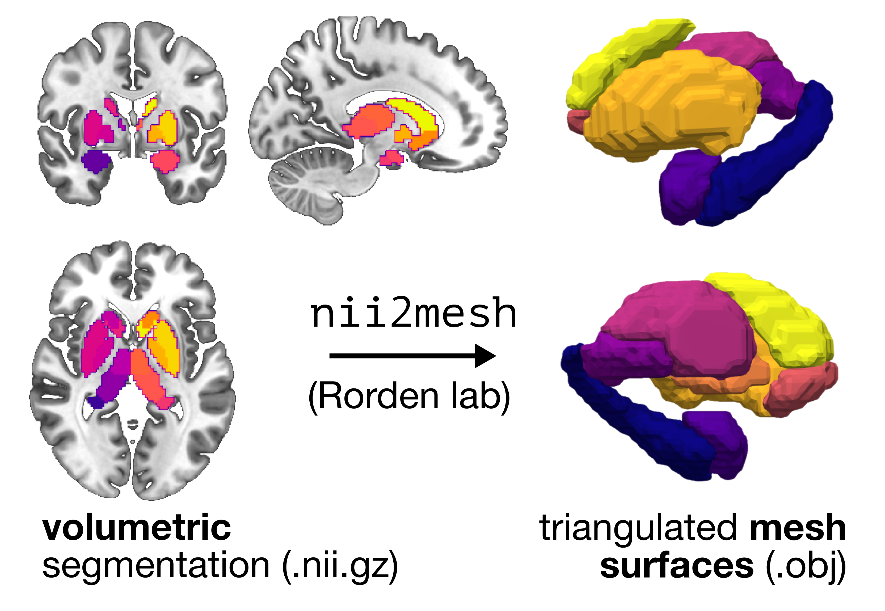
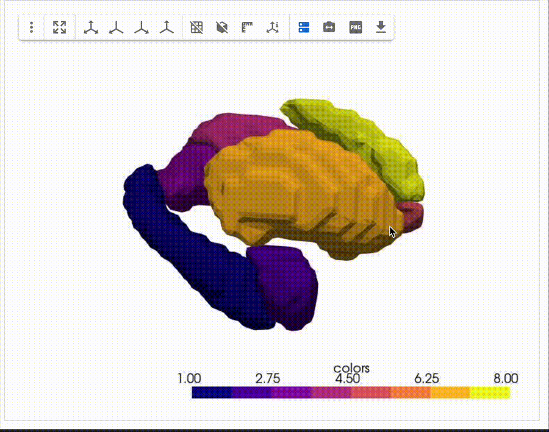
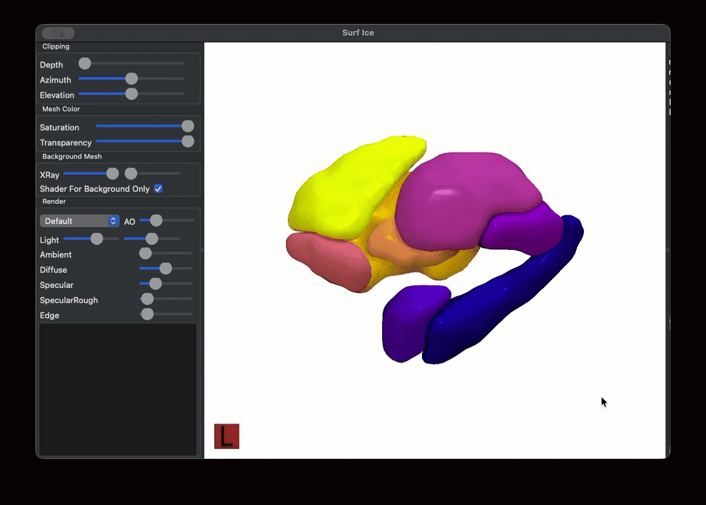
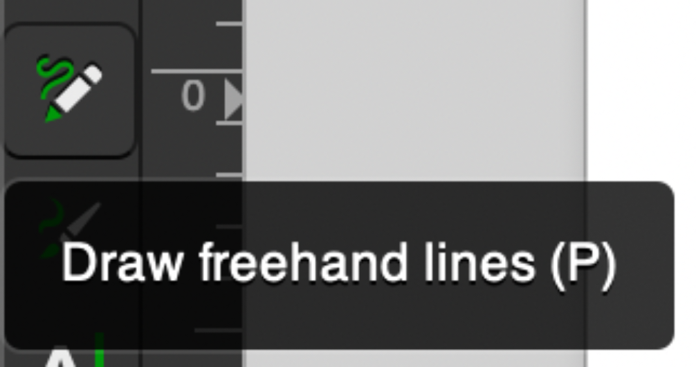
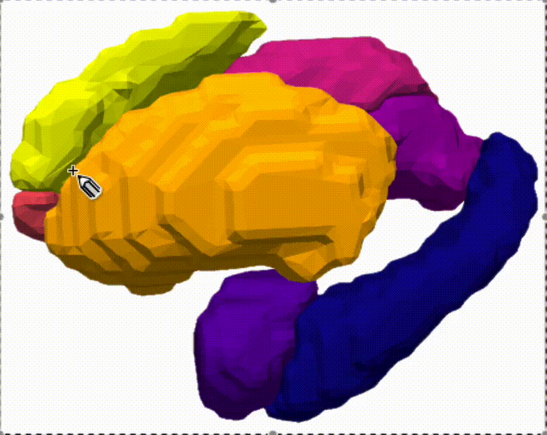
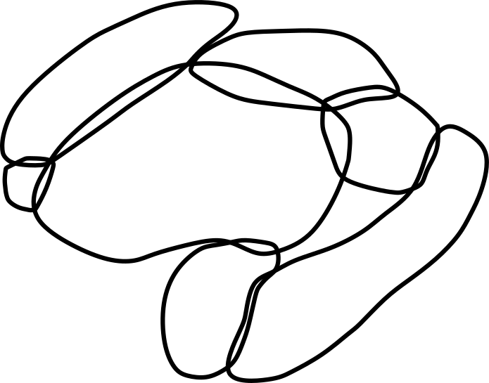
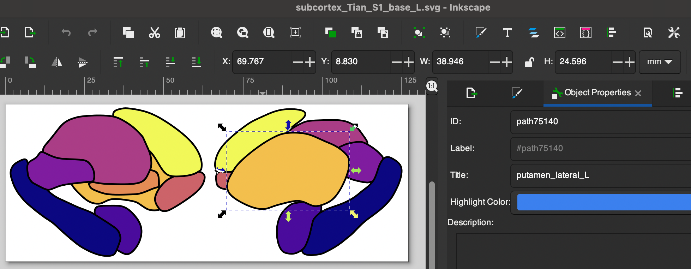
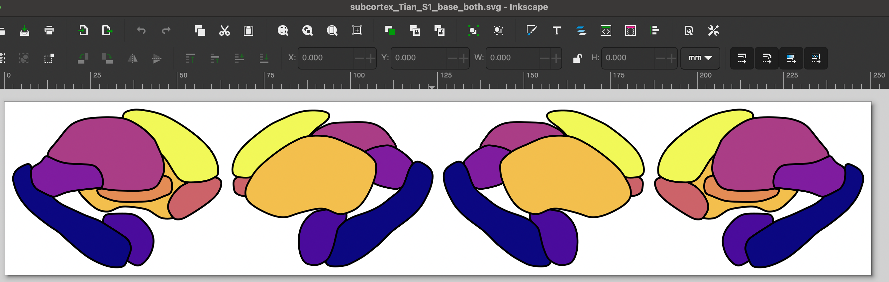

# How to generate your own two-dimensional segmentation for data viz

If you use a particular segmentation atlas in your research and would like to visualize data in that atlas in two dimensions, you can follow along with this guide!
These are the exact same steps we implemented to generate the segmentation visuals included in this python package for the `aseg` (FreeSurfer) and `S1`/`S2` (Melbourne Subcortex Atlas) atlases included here.

## Step 1. Creating and visualizing a custom triangulated mesh from a volumetric segmentation/parcellation

### Generating mesh files (.obj) per region

First, you'll want to convert from your three-dimensional segmentation atlas (stored as a NIFTI image) to a triangulated mesh rendering.
There are many tools out there to accomplish this depending on your preference; here, we'll suggest and walk through two options, both developed by [Chris Rorden's lab](): [`nii2mesh`](https://github.com/neurolabusc/nii2mesh) or [`surfice_atlas`](https://github.com/neurolabusc/surfice_atlas).
If you want a quick and simple mesh generation with outputs that can be viewed interactively in a Jupyter notebook (with control over the color maps, etc), follow along with option 1 (`nii2mesh` and `pyvista` combo).
If you want smoother mesh generation and more control over properties of the 3D rendering specifically geared towards brain data (and have Matlab), follow along with option 2 (`surfice_atlas` and `Surf Ice` combo).

### Option 1: `nii2mesh` + `pyvista`

Here, we'll use the [`nii2mesh` tool](https://github.com/neurolabusc/nii2mesh) developed by Chris Rorden:



The repository for this tool has really helpful documentation as well as a web-based platform that converts a NIFTI volume to a triangulated mesh (.obj) file without any installation or repository cloning.
It's an awesome resource, though we'll need to clone the repository to have full (local) access to the functionality needed to generate a mesh per index (i.e., region) in the segmentation volume.
Once you clone the repository, it's very straightforward to compile in C++.
Here are the steps, as copied from the `nii2mesh` [repository README](https://github.com/neurolabusc/nii2mesh):

```
git clone https://github.com/neurolabusc/nii2mesh
cd nii2mesh/src
make
```

Check that after running `make`, there is a binary file `nii2mesh` in the `nii2mesh/src/` directory, since that's the key function.
If everything looks good there, we'll use the `nii2mesh` program to generate an individual `.obj` mesh file per region in our segmentation atlas by setting the `-a 1` flag.
For example, if you're using a hippocampal subfield segmentation volume with 10 regions (voxels labeled 1 through 10 accordingly), the below script will generate 10 individual `.obj` mesh files:

```
nii2mesh my_custom_segmentation.nii.gz -a 1 my_custom_segmentation.obj
```

### Visualizing your mesh objects

There are a variety of programs that can render the `.obj` mesh files, including [Blender](https://www.blender.org/) and [3D Slicer](https://www.slicer.org/), as well as [online tools](https://3dviewer.net/).
If you're using a Mac, the Quick Look feature can also interactively render .obj meshes!

We've included a [simple Jupyter notebook](https://github.com/anniegbryant/subcortex_visualization/blob/main/custom_segmentation_pipeline/render_mesh_interactively.ipynb) guide to combine and render the meshes into one object that is interactive and color-coded by region:



If you use this method, we recommend rotating the object until you reach the desired angle(s) for generating your two-dimensional atlas, then exporting as a snapshot PNG image(s) by clicking the 'PNG' icon as shown in the above video.

### Option 2: `surfice_atlas` + `Surf Ice`

This method will generate one color-coded 3D mesh file (`.mz3`) for your segmentation, which can then be rendered interactively in the `Surf Ice` GUI software.
There are a few prerequisites for this step, which should be completed before you can crack on with your mesh generation: 

1. Clone the [`surfice_atlas`](https://github.com/neurolabusc/surfice_atlas) repository to your local machine with `git clone https://github.com/neurolabusc/surfice_atlas.git`
2. Clone the [`surfice_atlas`](https://github.com/neurolabusc/spmScripts) repository to your local machine with `git clone https://github.com/neurolabusc/spmScripts.git`
3. Download the [latest SPM](https://www.fil.ion.ucl.ac.uk/spm/software/) (Statistical Parametric Mapping) to wherever you store Matlab plugins
4. Download and install the `Surf Ice` (Version 6) graphical rendering software for your given operating systen from [NITRC](https://www.nitrc.org/projects/surfice/).

Once you've completed those four steps, we'll generate the `.mz3` file for an example segmentation in Matlab.
First, we'll add the relevant paths to Matlab:

```matlab
addpath('/path/to/github/surfice_atlas/'); % Change to where you cloned surfice_atlas
addpath('/path/to/github/spmScripts/'); % Change to where you cloned spmScripts
addpath('/path/to/MATLAB/spm/'); % Change to where you copied the spm folder
```

Now, it's a very simple process to convert our atlas segmentation to an `.mz3` file to read into Surf Ice:

```matlab
our_example_segmentation = '/path/to/example_segmentation.nii.gz';
lut = '/path/to/github/surfice_atlas/mylut.lut'; % We use the default LUT that came with surfice_atlas, you can create your own

nii_nii2atlas(our_example_segmentation, lut);
```

This will generate a file called `merge.mz3`, which contains color-coded mesh volumes for each region in your example segmentation.
Boot up Surf Ice and open the `merge.mz3` file (using File > Open to select merge.mz3), and you should have a color-coded three-dimensional mesh rendered on your screen.



If you use this method, we recommend rotating the object until you reach the desired angle(s) for generating your two-dimensional atlas, then taking a screenshot from the medial and lateral perspectives.

## 🎨 Tracing the outline of each region in vector graphic editing software

### Creating outlines for each region

Next, pour yourself a big mug of coffee to sit and trace the outline of each region in Inkscape (or a similar vector graphic editing program) ☕️
We'll walk you through the steps using Inkscape.

Open up a new image (.svg) in Inkscape, and import the PNG snapshot generated from the above rendered mesh by either clicking `⌘+I` (Mac) or `Ctrl+I` (Windows), or `File > Import`.
We'll use the 'Freehand lines' tool for tracing, which looks like the following along your toolbar:



And then go ahead and trace your first region in your image!
We recommend setting 'Smoothing' in your top toolbar to around 20 (we use 22.0), which means that you can do a pretty quick first pass at tracing each region and the path won't stick to every bump you draw.



Once you finish your first trace, if you want to edit any of the points in the path, just double-click on the black line and you can click and drag the points to adjust their spacing.
Rinse and repeat: go ahead and trace the outline for all of the regions in your atlas.
Once you finish, when you take away the 3D mesh PNG underneath, you should have a set of outlines that resemble a minimalist aesthetic line-art tattoo like so:



### Labeling each region in the SVG metadata

After you finish tracing the outline for each region, you can store the name of that region along with the face (medial or lateral) and hemisphere (right or left) to identify that region programmatically in python.
In Inkscape, you can accomplish this by selecting a given region (here, the left putamen shown on the lateral face).
In the 'Object Properties' pane shown on the right, in the 'Title' text box, you should then put the name of the region (e.g., 'putamen'), face (e.g., 'lateral'), and abbreviation (e.g., 'L'), all as one string separated by underscores, as shown in the screenshot.
In other words, for the highlighted region, its Title should be 'putamen_lateral_L':



Once you add the title to each region, congrats, you've finished creating the vector graphic for the given hemisphere for your custom atlas!

### Repeating for the other hemisphere

You may notice that the above SVG image is saved as 'subcortex_Melbourne_S1_L.svg', which indicates that this file corresponds to: 
* subcortex
* Melbourne Subcortex Atlas, granularity level 1 (S1)
* left hemisphere (L)

If your atlas is left-right symmetric, you can just copy-paste the SVG objects into a new file named e.g., 'subcortex_Melbourne_S1_R.svg', making sure you (1) flip the image along the $y$-axis (i.e., left-right mirror) and update each region's Title to end with '_R' rather than '_L'.

### Combining the left and right hemispheres into one image

Once you have both hemispheres traced, the last step here is to copy-paste the left and right hemisphere vector graphics into the same image for an SVG corresponding to both hemispheres, named e.g. 'subcortex_Melbourne_S1_both.svg'.
Make sure all the individual regions have appropriate Title text fields corresponding to the region name, face, and hemisphere.





## 🗂️ Organizing the file structure correctly for your custom atlas

Once you have all your regions traced in the left and right hemispheres for your segmentation, in the `subcortex_visualization/data/` folder, make sure you have the following SVG files--in this case, corresponding to the Melbourne S1 subcortical atlas:

* subcortex_Melbourne_S1_both.svg
* subcortex_Melbourne_S1_L.svg
* subcortex_Melbourne_S1_R.svg

### 🔎 Lookup tables to indicate the order for drawing regions

Home stretch, you're almost done 🏃‍♀️

One of the last steps to get plotting with your custom atlas to create a lookup table for each of the three SVG images (left, right, and both hemispheres).
Each table, in .csv format, should have the following four columns: 
1. `region`: name of the region (e.g., 'accumbens')
2. `face`: which face to plot (e.g., 'lateral')
3. `plot_order`: in which order should this region be plotted? A value of 1 means this region will be drawn first (i.e., on the bottom) and higher values mean the region will be drawn higher in the stack (i.e., closer to the top). This is only relevant if some regions are overlapping and you care about plotting order.
4. `Hemisphere`: which hemisphere the corresponding region belongs to (should be all 'L' for left hemisphere and 'R' for right hemisphere).

Take a look at the examine lookup tables provided for the Melbourne Subcortex Atlas S1 segmentation in the [left hemisphere], [right hemisphere], and both hemispheres to see exactly how these files are organized.
In the case of the Melbourne Subcortex Atlas S1 subcortical atlas, this corresponds to three lookup table files:

* Melbourne_S1_both_ordering.csv
* Melbourne_S1_L_ordering.csv
* Melbourne_S1_R_ordering.csv

And with that, you'll just need to reinstall the python package once you've added your new vector graphics and lookup tables! 
That can be accomplished by simply navigating to the base level of this repository and running:

```bash 
# Change to where you've cloned this repo
cd /path/to/github/subcortex_visualization 

# To reinstall the subcortex-visualization package
python3 -m pip install . 
```