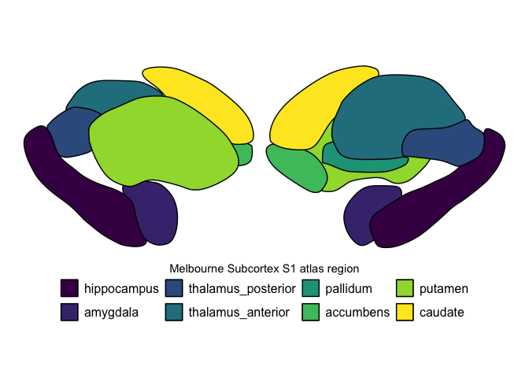
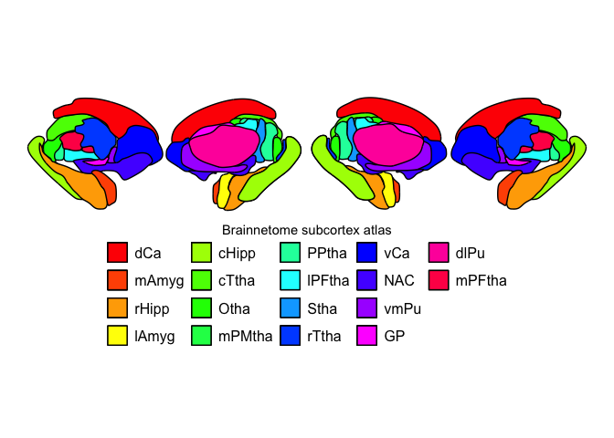

subcortexVisualizationR tutorial
================
2026-01-29

## Load required packages

``` r
library(subcortexVisualizationR)
```

    ## Loading required package: tidyverse

    ## ── Attaching core tidyverse packages ──────────────────────── tidyverse 2.0.0 ──
    ## ✔ dplyr     1.1.4     ✔ readr     2.1.6
    ## ✔ forcats   1.0.1     ✔ stringr   1.6.0
    ## ✔ ggplot2   4.0.1     ✔ tibble    3.3.1
    ## ✔ lubridate 1.9.4     ✔ tidyr     1.3.2
    ## ✔ purrr     1.2.1     
    ## ── Conflicts ────────────────────────────────────────── tidyverse_conflicts() ──
    ## ✖ dplyr::filter() masks stats::filter()
    ## ✖ dplyr::lag()    masks stats::lag()
    ## ℹ Use the conflicted package (<http://conflicted.r-lib.org/>) to force all conflicts to become errors

``` r
library(tidyverse)
```

## Example data just to show the different regions

First, let’s create a simple dataframe with the left hemisphere cortical
regions, assigning a different value to each region for visual clarity.
Note that all data passed to `plot_subcortical_data` needs to follow the
same three-column structure as shown below: `region` (the name of the
subcortical region with the same nomenclature as shown), `value` (the
value to be plotted in the subcortex map), and `Hemisphere` (either ‘L’,
‘R’, or ‘both’).

``` r
# Set seed for reproducibility

example_subcortex_data = data.frame(region = c("accumbens", "amygdala", 
                                               "caudate", "hippocampus", 
                                               "pallidum", "putamen", 
                                               "thalamus"),
                                    value = 1:7,
                                    Hemisphere = "L")

example_subcortex_data
```

    ##        region value Hemisphere
    ## 1   accumbens     1          L
    ## 2    amygdala     2          L
    ## 3     caudate     3          L
    ## 4 hippocampus     4          L
    ## 5    pallidum     5          L
    ## 6     putamen     6          L
    ## 7    thalamus     7          L

Now, we can plot this data with the `plasma` colormap as an example in
the left cortex. Note the following arguments:

- `subcortex_data`: The three-column data.frame shown above
- `atlas`: The name of the atlas to plot
- `line_thickness`: How thick the lines around each subcortical region
  should be drawn, in mm (default is 0.5)
- `line_color`: What color the lines around each subcortical region
  should be (default is ‘black’)
- `hemisphere`: Which hemisphere (‘L’ or ‘R’) the `subcortex_data` is
  from; can also be ‘both’ (default is ‘L’)
- `fill_title`: Name to add to legend
- `cmap`: Name of colormap (e.g., ‘plasma’ or ‘viridis’) or a
  `matplotlib.colors.Colormap` (default is ‘viridis’)
- `vmin`: Min fill value; this is optional, and you would only want to
  use this to manually constrain the fill range to match another figure
- `vmax`: Max fill value; this is optional, and you would only want to
  use this to manually constrain the fill range to match another figure

``` r
plot_subcortical_data(subcortex_data=example_subcortex_data, atlas = 'aseg',
                      line_thickness=0.5, line_color='black',
                          hemisphere='L', fill_title = "aseg region index", cmap='plasma', 
                          vmin=NA, vmax=NA)
```

    ## SVG contains a tag not currently handled: <namedview>

    ## Joining with `by = join_by(region, Hemisphere, face)`
    ## Joining with `by = join_by(region, Hemisphere)`

<!-- -->

If we wanted to plot this with the `inferno` color palette instead, just
swap out the `cmap` argument values:

``` r
plot_subcortical_data(subcortex_data=example_subcortex_data, atlas = 'aseg', 
                      hemisphere='L', fill_title = "aseg region index", cmap='inferno')
```

    ## SVG contains a tag not currently handled: <namedview>

    ## Joining with `by = join_by(region, Hemisphere, face)`
    ## Joining with `by = join_by(region, Hemisphere)`

<!-- -->

By default, `plot_subcortical_data` will plot the index values of each
region, so we actually don’t need to pass in a dataframe for this
visualization purpose. Here, we can plot the region indices for the
Melbourne Subcortex S1 atlas in the right hemisphere without passing in
any data:

``` r
plot_subcortical_data(atlas = 'Melbourne_S1', hemisphere='R', 
                      fill_title = "Melbourne Subcortex S1 atlas region", 
                      cmap='viridis')
```

    ## SVG contains a tag not currently handled: <namedview>

    ## Joining with `by = join_by(region, Hemisphere, face)`

<!-- -->

To plot both hemispheres using gray lines at thickness 1.0, we can set
the `hemisphere` argument to ‘both’ and adjust the `line_thickness` and
`line_color` arguments accordingly:

``` r
plot_subcortical_data(atlas = 'Melbourne_S1', hemisphere='both', 
                      line_color='gray', line_thickness=1,
                      fill_title = "Melbourne Subcortex S1 atlas region", cmap='viridis')
```

    ## SVG contains a tag not currently handled: <namedview>

    ## Joining with `by = join_by(region, Hemisphere, face)`

<!-- -->

We can also use the S2 level of granularity from the Melbourne Subcortex
(Tian 2020) Atlas:

``` r
plot_subcortical_data(atlas = 'Melbourne_S2', hemisphere='both', 
                      fill_title = "Melbourne Subcortex S2 atlas", cmap=rainbow)
```

    ## SVG contains a tag not currently handled: <namedview>

    ## Joining with `by = join_by(region, Hemisphere, face)`

<!-- -->

Lastly, let’s view the atlas for (1) [AICHA
subcortex](https://www.sciencedirect.com/science/article/abs/pii/S0165027015002678);
(2) [Brainnetome
subcortex](https://pmc.ncbi.nlm.nih.gov/articles/PMC4961028/); and (3)
[SUIT cerebellum](https://doi.org/10.1016/j.neuroimage.2006.05.056):

``` r
# AICHA
plot_subcortical_data(atlas = 'AICHA', hemisphere='both', 
                      fill_title = "AICHA subcortex atlas", cmap=rainbow)
```

    ## SVG contains a tag not currently handled: <namedview>

    ## Joining with `by = join_by(region, Hemisphere, face)`

<!-- -->

``` r
# Brainnetome
plot_subcortical_data(atlas = 'Brainnetome', hemisphere='both', 
                      fill_title = "Brainnetome subcortex atlas", cmap=rainbow)
```

    ## SVG contains a tag not currently handled: <namedview>

    ## Joining with `by = join_by(region, Hemisphere, face)`

<!-- -->

``` r
# SUIT cerebellum
plot_subcortical_data(atlas = 'SUIT_cerebellar_lobule', hemisphere='both', 
                      fill_title = "SUIT cerebellum atlas", cmap=rainbow)
```

    ## [1] "Individual-hemisphere visualization is not supported with the SUIT cerebellar lobule atlas. Rendering both hemispheres together, along with the vermis."

    ## SVG contains a tag not currently handled: <namedview>

    ## Joining with `by = join_by(region, Hemisphere, face)`

<!-- -->

## Simulating and visualizing continuous data

``` r
set.seed(127)


example_continuous_data_L <- data.frame(region = c("accumbens", "amygdala", 
                                                "caudate", "hippocampus", 
                                                "pallidum", "putamen", 
                                                "thalamus"),
                                       Hemisphere = 'L',
                                    value = rnorm(7))

example_continuous_data_R <- data.frame(region = c("accumbens", "amygdala", 
                                                "caudate", "hippocampus", 
                                                "pallidum", "putamen", 
                                                "thalamus"),
                                       Hemisphere = 'R',
                                    value = rnorm(7))


example_continuous_data <- rbind(example_continuous_data_L, example_continuous_data_R)


# See what the left hemisphere data, randomly sampled from a normal distribution, looks like
example_continuous_data
```

    ##         region Hemisphere        value
    ## 1    accumbens          L -0.567733740
    ## 2     amygdala          L -0.814760579
    ## 3      caudate          L -0.493939596
    ## 4  hippocampus          L  0.001818846
    ## 5     pallidum          L  0.819784933
    ## 6      putamen          L  0.996757858
    ## 7     thalamus          L  0.751782219
    ## 8    accumbens          R -0.125547223
    ## 9     amygdala          R  0.564619888
    ## 10     caudate          R  0.133508557
    ## 11 hippocampus          R -0.105963209
    ## 12    pallidum          R  0.605929618
    ## 13     putamen          R  0.013250975
    ## 14    thalamus          R -0.278788699

Plot the left hemisphere:

``` r
plot_subcortical_data(subcortex_data=example_continuous_data_L, atlas = 'aseg',
                      hemisphere='L', fill_title = "Normal distribution sample, aseg atlas", 
                      cmap='viridis')
```

    ## SVG contains a tag not currently handled: <namedview>

    ## Joining with `by = join_by(region, Hemisphere, face)`
    ## Joining with `by = join_by(region, Hemisphere)`

<!-- -->

Right hemisphere:

``` r
plot_subcortical_data(subcortex_data=example_continuous_data_R, atlas = 'aseg',
                      hemisphere='R', fill_title = "Normal distribution sample, aseg atlas", 
                      cmap='viridis')
```

    ## SVG contains a tag not currently handled: <namedview>

    ## Joining with `by = join_by(region, Hemisphere, face)`
    ## Joining with `by = join_by(region, Hemisphere)`

<!-- -->

Both hemispheres together:

``` r
plot_subcortical_data(subcortex_data=example_continuous_data, atlas = 'aseg', 
                      hemisphere='both', fill_title = "Normal distribution sample, aseg atlas", 
                      cmap='viridis')
```

    ## SVG contains a tag not currently handled: <namedview>

    ## Joining with `by = join_by(region, Hemisphere, face)`
    ## Joining with `by = join_by(region, Hemisphere)`

<!-- -->

You can pass in a custom colormap too! For example, if you want to fill
in with a gradient ranging from white to purple:

``` r
plot_subcortical_data(subcortex_data=example_continuous_data, atlas = 'aseg', 
                      hemisphere='both', fill_title = "Normal distribution sample", 
                      cmap=c('white', '#76167D'))
```

    ## SVG contains a tag not currently handled: <namedview>

    ## Joining with `by = join_by(region, Hemisphere, face)`
    ## Joining with `by = join_by(region, Hemisphere)`

<!-- -->

Since this data has positive and negative values,

Since this data has positive and negative values, we can pass in a color
palette from blue (negative) to white (0) to red (positive).
`plot_subcortical_data` takes an argument `midpoint` that specifies the
center point for the color palette. Setting this to 0 here enforces the
center value to be white. Without setting vmin/vmax explicitly, the
color range will be defined symmetrically around `midpoint` to capture
the full range of the data.

``` r
plot_subcortical_data(subcortex_data=example_continuous_data, atlas = 'aseg',  
                      hemisphere='both', fill_title = "Normal distribution sample", 
                      cmap=c("blue", "white", "red"), midpoint=0)
```

    ## SVG contains a tag not currently handled: <namedview>

    ## Joining with `by = join_by(region, Hemisphere, face)`
    ## Joining with `by = join_by(region, Hemisphere)`

<!-- -->
