# R tutorial

`subcortexVisualizationR` is an open-source R package for
programmatically visualizing region-level data across twelve popular
atlases for the subcortex (including thalamic nuclei and the brainstem)
and cerebellum. Visualizations are rendered as resolution-independent
two-dimensional vector graphics, inspired by the `ggseg` R package for
cortical data, with standardized rendering conventions that make results
directly comparable across atlases.

This tutorial covers the core functionality of the package:

1.  **Exploring the built-in atlases**: Viewing the twelve included
    atlases with default and custom colormaps
2.  **Choosing view angles**: Displaying medial, lateral, superior, and
    inferior views
3.  **Controlling transparency**: Global alpha and significance-based
    transparency
4.  **Working with your own data**: Formatting and plotting empirical
    region-level data
5.  **Extracting regional statistics from volumetric data**: Using
    `parcel_segstats` to parcellate NIfTI images
6.  **Combining cortical and subcortical visualizations**: Integrating
    with `ggseg` for whole-brain figures

An equivalent Python package, `subcortex_visualization`, provides the
same functionality and atlases with a nearly identical interface.

## Load required packages

The following libraries are needed to create the specific visual styles
that are included in this tutorial.

``` r
library(cowplot)
library(glue)
library(grid)
library(patchwork)
library(subcortexVisualizationR)
library(tidyverse)

theme_set(theme_cowplot())
```

## 1. Exploring the built-in atlases

The package includes twelve pre-vectorized subcortical and cerebellar
atlases that serve as scaffolds for visualizing region-level summary
statistics:

| Atlas | Regions |
|----|----|
| `aseg_subcortex` | FreeSurfer aseg: accumbens, amygdala, caudate, hippocampus, pallidum, putamen, thalamus |
| `Melbourne_S1` through `Melbourne_S4` | Melbourne Subcortex Atlas at four resolutions (8-27 subcortical regions per hemisphere) |
| `AICHA_subcortex` | AICHA subcortical atlas (20 regions per hemisphere) |
| `Brainnetome_subcortex` | Brainnetome subcortical atlas (18 regions per hemisphere) |
| `CIT168_subcortex` | CIT168 reinforcement learning atlas (14 regions per hemisphere) |
| `Thalamus_HCP` | HCP-based thalamic nuclei (7 nuclei per hemisphere) |
| `Thalamus_THOMAS` | THOMAS thalamic nuclei atlas (11 nuclei per hemisphere) |
| `Brainstem_Navigator` | Brainstem Navigator atlas (29 bilateral regions per hemisphere + 8 midline regions) |
| `SUIT_cerebellar_lobule` | SUIT cerebellar lobule atlas (17 unique regions; 10 per hemisphere, 7 midline vermis regions) |

### `plot_subcortical_data`

The central function is `plot_subcortical_data`. With default
parameters, it plots one color per region using the `viridis` colormap
for the left hemisphere of the aseg subcortex atlas. More information
about function arguments can be found in the API reference for
[Python](https://anniegbryant.github.io/subcortex_visualization/python_api)
and [R](https://anniegbryant.github.io/subcortex_visualization/R_api).

``` r
plot_subcortical_data(fill_title = "Demonstrating default parameters",
                      show_legend = TRUE)
```

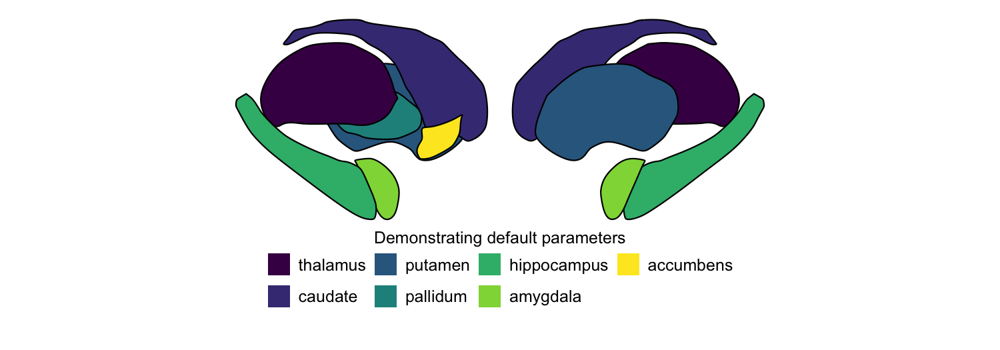<!-- -->

We can easily swap out the atlas for any of the other eleven. Here we
plot the AICHA subcortex atlas with the `plasma` colormap and the
Brainnetome subcortex atlas with the `Spectral` colormap, both for both
hemispheres:

``` r
# A. AICHA subcortex atlas, plasma colormap
plot_subcortical_data(atlas = "AICHA_subcortex", cmap = "plasma", hemisphere = 'both',
                      fill_title = "AICHA subcortex with plasma colormap")
```

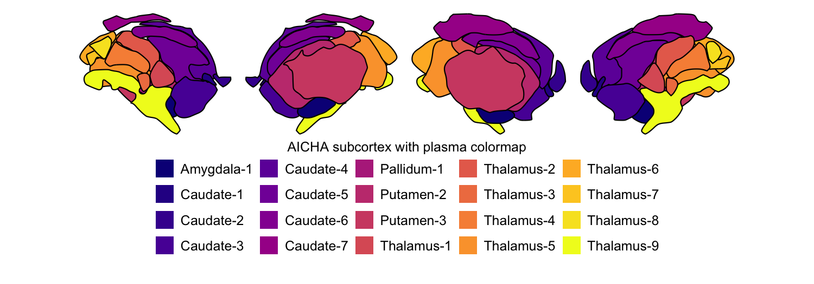<!-- -->

``` r
# B. Brainnetome subcortex atlas, Spectral colormap
rainbow_cmap <- colorRampPalette(RColorBrewer::brewer.pal(11, 'Spectral'))
plot_subcortical_data(atlas = "Brainnetome_subcortex", cmap = rainbow_cmap, hemisphere = 'both',
                      fill_title = "Brainnetome subcortex with Spectral colormap")
```

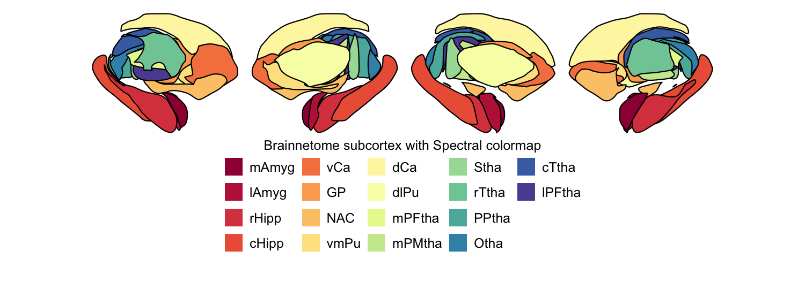<!-- -->

## 2. Choosing view angles

For each atlas, medial, lateral, superior, and inferior views are
available for both hemispheres, either separately or combined. By
default, `plot_subcortical_data` shows medial and lateral views. You can
specify any combination with the `views` argument.

The one exception is the SUIT cerebellar lobule atlas, which is based on
a two-dimensional flatmap representation of the cerebellum and is not
designed to be shown in three-dimensional views.

Here we demonstrate all four views with the THOMAS thalamic nuclei atlas
and the Brainstem Navigator atlas:

``` r
# A. THOMAS thalamic nuclei atlas
THOMAS_cmap <- colorRampPalette(c("white", "#d14662"))
plot_subcortical_data(atlas = "Thalamus_THOMAS", cmap = THOMAS_cmap, hemisphere = 'both',
                      views = c('lateral', 'medial', 'superior', 'inferior'),
                      show_legend = FALSE, fill_title = "THOMAS thalamic nuclei")
```

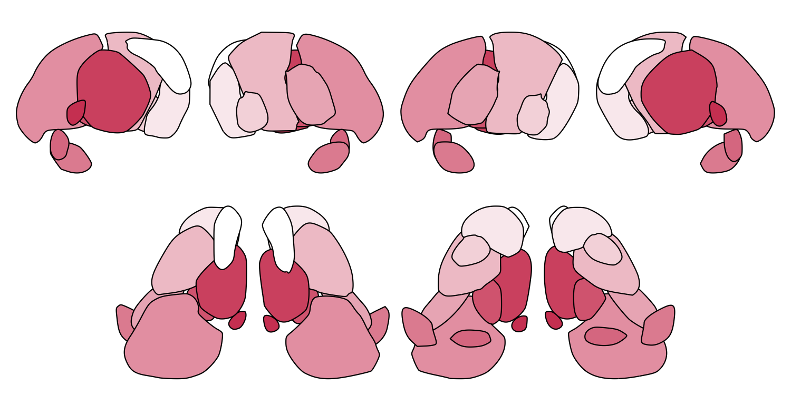<!-- -->

``` r
# B. Brainstem Navigator atlas
Brainstem_cmap <- colorRampPalette(c("white", "#c8499b"))
plot_subcortical_data(atlas = "Brainstem_Navigator", cmap = Brainstem_cmap, hemisphere = 'both',
                      views = c('lateral', 'medial', 'superior', 'inferior'),
                      show_legend = FALSE, fill_title = "Brainstem Navigator")
```

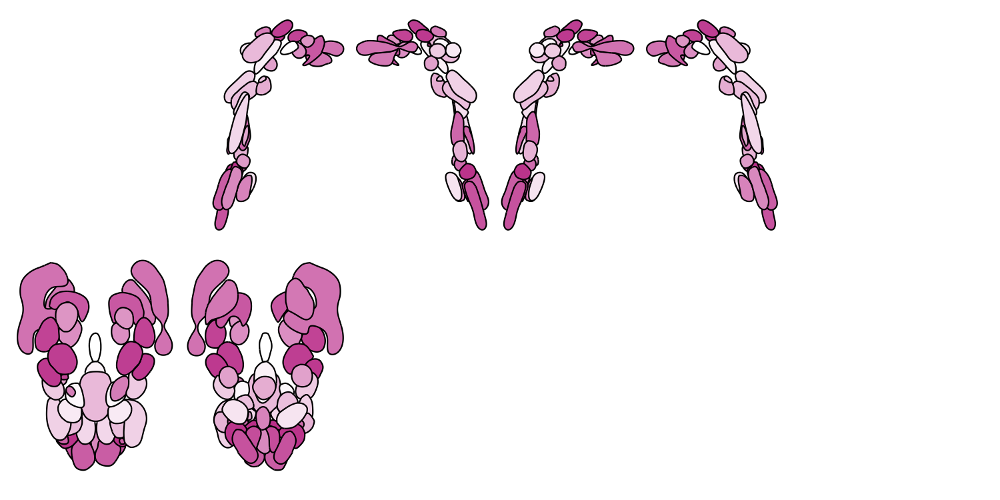<!-- -->

## 3. Controlling transparency

### Global alpha with `fill_alpha`

The `fill_alpha` argument controls the overall opacity of all regions (0
= fully transparent, 1 = fully opaque). This is particularly useful for
atlases with many overlapping nuclei, where reducing transparency helps
resolve individual regions. Here we loop through five alpha values for
the Melbourne Subcortex S2 atlas:

``` r
for (fill_alpha in seq(0.2, 1, by = 0.2)) {
    this_alpha_plot <- plot_subcortical_data(atlas = 'Melbourne_S2', fill_alpha = fill_alpha,
                                             cmap = 'plasma', show_legend = FALSE)
    print(this_alpha_plot)
}
```

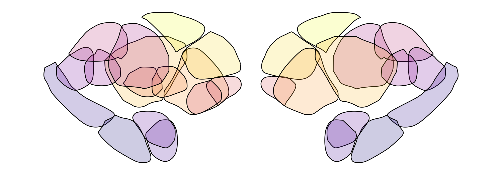<!-- -->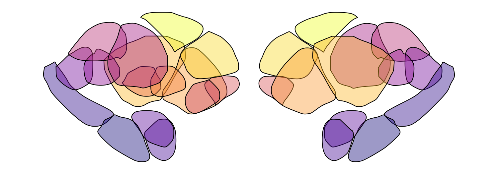<!-- -->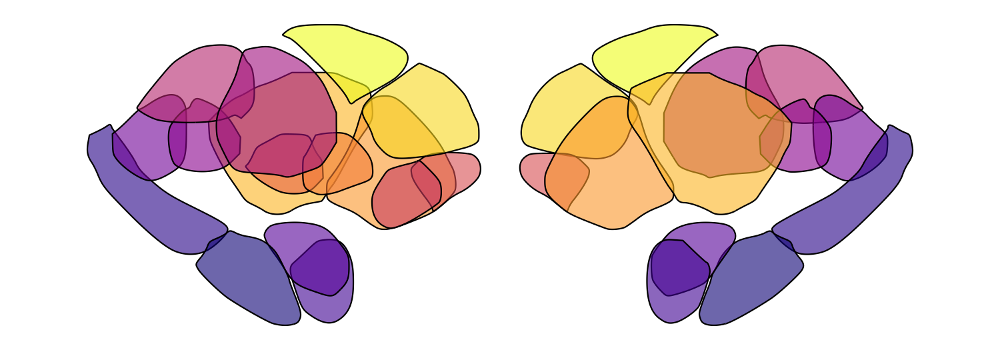<!-- -->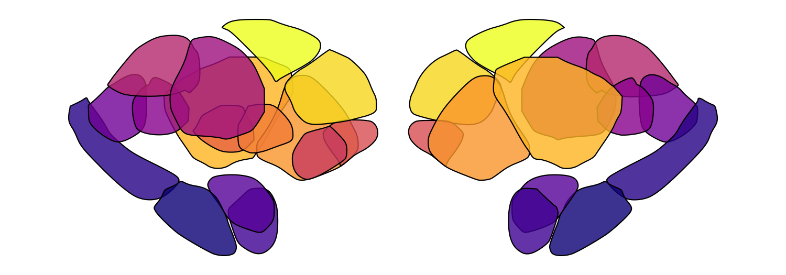<!-- -->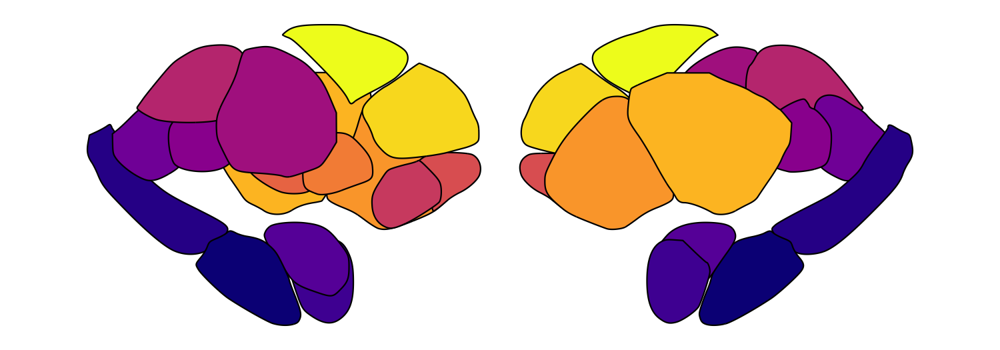<!-- -->

### Significance-based transparency

`plot_subcortical_data` also supports significance-based transparency
through `fill_by_significance = TRUE`. When enabled:

- Regions with `p_value < 0.05` are rendered at `fill_alpha` (default
  1.0) with full-weight borders
- Regions with `p_value >= 0.05` are rendered at `nonsig_fill_alpha`
  (default 0.5) with borders at `0.25 × line_thickness`

This requires a `p_value` column in your `subcortex_data` data frame (an
error will be thrown if it’s missing). Here we simulate data for the
SUIT cerebellar lobule atlas and flag the four regions with the largest
absolute effect size as significant:

``` r
set.seed(128) # Note: R and Python have different random number generators, so results won't be identical

this_atlas <- 'SUIT_cerebellar_lobule'
this_atlas_regions <- get_atlas_regions(this_atlas)
this_atlas_hemisphere_regions <- this_atlas_regions$hemisphere_regions
this_atlas_vermis_regions <- this_atlas_regions$vermis_regions

# Simulate continuous data for plotting
this_atlas_simdata <- data.frame(
    region = c(this_atlas_hemisphere_regions, this_atlas_hemisphere_regions, this_atlas_vermis_regions),
    Hemisphere = c(rep('L', length(this_atlas_hemisphere_regions)),
                   rep('R', length(this_atlas_hemisphere_regions)),
                   rep('V', length(this_atlas_vermis_regions))))
this_atlas_simdata$value <- rnorm(nrow(this_atlas_simdata), mean = 0, sd = 1)
this_atlas_simdata$p_value <- runif(nrow(this_atlas_simdata), min = 0.05, max = 1.0)

# Set the four largest-magnitude values to be significant (p < 0.05)
largest_indices <- order(abs(this_atlas_simdata$value), decreasing = TRUE)[1:4]
this_atlas_simdata$p_value[largest_indices] <- 0.01

# PiYG-inspired colormap
PiYG_cmap <- colorRampPalette(c("#C51B7D", "#E9A3C9", "#FDE0EF", "#F7F7F7",
                                 "#E6F5D0", "#A1D76A", "#4D9221"))
plot_subcortical_data(atlas = this_atlas, subcortex_data = this_atlas_simdata, hemisphere = 'both',
                      midpoint = 0, cmap = PiYG_cmap, show_legend = TRUE, line_thickness = 1.5,
                      fill_title = "Simulated statistical test results",
                      fill_alpha = 1.0, fill_by_significance = TRUE, nonsig_fill_alpha = 0.5)
```

<!-- -->

## 4. Working with your own data

The key requirement for visualizing empirical data with
`plot_subcortical_data` is that your region names exactly match those
defined in the atlas (including capitalization and spacing). Use
`get_atlas_regions` to check the exact names for any atlas:

``` r
# Most atlases return a character vector of region names
aseg_regions <- get_atlas_regions('aseg_subcortex')
cat('aseg_subcortex regions:', paste(aseg_regions, collapse = ', '), '\n')
```

    ## aseg_subcortex regions: thalamus, caudate, putamen, pallidum, hippocampus, amygdala, accumbens

``` r
# >>> get_atlas_regions('Melbourne_S1')
# [1] "hippocampus"        "amygdala"           "thalamus_posterior"
# [4] "thalamus_anterior"  "pallidum"           "accumbens"
# [7] "putamen"            "caudate"

# SUIT_cerebellar_lobule and Brainstem_Navigator return a named list
suit_regions <- get_atlas_regions('SUIT_cerebellar_lobule')
cat('SUIT hemisphere regions:', paste(suit_regions$hemisphere_regions, collapse = ', '), '\n')
```

    ## SUIT hemisphere regions: IV, V, VI, Crus_I, Crus_II, VIIb, VIIIa, VIIIb, IX, X

``` r
cat('SUIT vermis regions:', paste(suit_regions$vermis_regions, collapse = ', '), '\n')
```

    ## SUIT vermis regions: VI, Crus_II, VIIb, VIIIa, VIIIb, IX, X

``` r
brainstem_regions <- get_atlas_regions('Brainstem_Navigator')
cat('Brainstem hemisphere regions:', paste(brainstem_regions$hemisphere_regions, collapse = ', '), '\n')
```

    ## Brainstem hemisphere regions: CnF, IC, ION, LC, LDTg_CGPn, LPB, MiTg_PBG, MPB, PCRtA, PnO_PnC, PTg, RN1, RN2, SC, SN1, SN2, SOC, SubC, Ve, VSM, VTA_PBP, iMRtl, iMRtm, isRt, mRta, mRtd, mRtl, sMRtl, sMRtm

``` r
cat('Brainstem midline regions:', paste(brainstem_regions$midline_regions, collapse = ', '), '\n')
```

    ## Brainstem midline regions: CLi_RLi, DR, MnR, PAG, PMnR, RMg, ROb, RPa

Region names for each atlas are also listed on the [package
website](https://anniegbryant.github.io/subcortex_visualization/atlas_info/).

### Plotting continuous data

The `subcortex_data` data frame needs three columns:

- `region`: Region names matching the atlas exactly
- `value`: Numeric values to color-map
- `Hemisphere`: `'L'`, `'R'`, `'V'` (vermis, for cerebellum), or `'B'`
  (bilateral/midline regions)

Let’s simulate random continuous data for the aseg subcortex atlas to
demonstrate this:

``` r
set.seed(127) # Set random seed for reproducibility

# Get region names for the aseg subcortex atlas
aseg_subcortex_regions <- get_atlas_regions("aseg_subcortex")

# Sample random values from a normal distribution for each hemisphere
example_continuous_data_L <- data.frame(region = aseg_subcortex_regions,
                                        value = rnorm(length(aseg_subcortex_regions), mean = 0, sd = 1),
                                        Hemisphere = "L")
example_continuous_data_R <- data.frame(region = aseg_subcortex_regions,
                                        value = rnorm(length(aseg_subcortex_regions), mean = 0, sd = 1),
                                        Hemisphere = "R")

# Combine left and right hemisphere data for bilateral plotting
example_continuous_data <- rbind(example_continuous_data_L, example_continuous_data_R)
example_continuous_data
```

    ##         region        value Hemisphere
    ## 1     thalamus -0.567733740          L
    ## 2      caudate -0.814760579          L
    ## 3      putamen -0.493939596          L
    ## 4     pallidum  0.001818846          L
    ## 5  hippocampus  0.819784933          L
    ## 6     amygdala  0.996757858          L
    ## 7    accumbens  0.751782219          L
    ## 8     thalamus -0.125547223          R
    ## 9      caudate  0.564619888          R
    ## 10     putamen  0.133508557          R
    ## 11    pallidum -0.105963209          R
    ## 12 hippocampus  0.605929618          R
    ## 13    amygdala  0.013250975          R
    ## 14   accumbens -0.278788699          R

``` r
plot_subcortical_data(subcortex_data = example_continuous_data,
                      atlas = 'aseg_subcortex', hemisphere = 'both', cmap = 'viridis',
                      fill_title = "Normal distribution sample, aseg subcortex atlas")
```

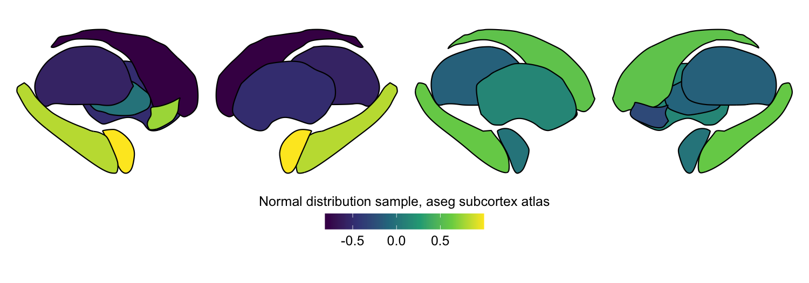<!-- -->

### Custom colormaps and the `midpoint` argument

You can pass any colormap (or create a custom one with
`colorRampPalette`) to the `cmap` argument. Since this simulated data
spans negative and positive values, a diverging blue-white-red colormap
is a natural choice.

The `midpoint` argument specifies the center value of the color scale.
Setting this to 0 maps the center color to 0, with symmetric bounds
determined automatically from the data range (unless you also set `vmin`
and `vmax` explicitly). Without explicitly setting vmin/vmax, the color
range will be defined symmetrically around `midpoint` to capture the
full range of the data.

``` r
# Create a blue-white-red colormap
white_blue_red_cmap <- colorRampPalette(c("blue", "white", "red"))

plot_subcortical_data(subcortex_data = example_continuous_data,
                      atlas = 'aseg_subcortex', hemisphere = 'both',
                      fill_title = "Normal distribution sample, aseg subcortex atlas",
                      cmap = white_blue_red_cmap, midpoint = 0)
```

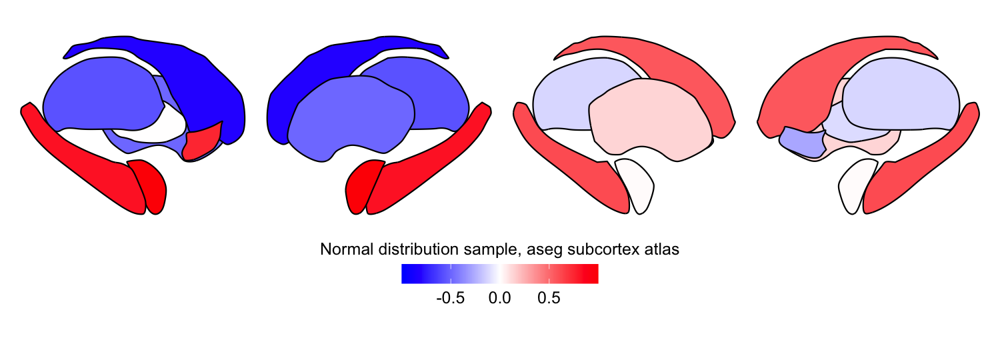<!-- -->

## 5. Extracting regional statistics from volumetric data

In many cases, you may have a three-dimensional volumetric image (from
any imaging modality) and want to reduce it down to region-level summary
statistics before plotting. The `parcel_segstats` function handles this:
it takes a NIfTI image and an atlas name and computes a user-specified
summary statistic for all voxels in each region.

For the `parc_stat` argument, you can pass any function that takes an
array of values and returns a single scalar — `mean`, `sd`, `median`,
`max`, etc.

The output data frame is pre-formatted for direct use with
`plot_subcortical_data` (no reformatting needed).

### Atlas space compatibility

The atlases are provided in two MNI spaces: `MNI152NLin6Asym` (default)
and `MNI152NLin2009cAsym`. Your input volume must be in one of these two
spaces to use our package to compute region-aggregated statistics in one
or more of the included atlases. If the affine or spatial dimensions
don’t match, `parcel_segstats` will raise an error by default. You can
specify an `interpolation` method (`'nearest'`, `'linear'`, or
`'cubic'`) to resample the atlas to your input volume, though we
encourage you to take care with atlas alignment and, wherever possible,
normalize your data to the correct MNI space rather than relying on
interpolation.

Here we compute the median CB1 receptor density per region in the aseg
subcortex atlas from a group-averaged PET map:

``` r
# Define file paths for download
CB1_density_URL = "https://github.com/netneurolab/hansen_receptorvar/blob/main/data/PET_volumes/CB1_fmpepVt2_hc20_nummenmaa_mean.nii.gz?raw=true"
download.file(url = CB1_density_URL, destfile = "CB1_mean.nii.gz", mode = "wb", quiet=TRUE)
functional_map_path <- "CB1_mean.nii.gz"

atlas_name <- "aseg_subcortex"
func_name <- "CB1_density"

# The PET maps are shared in MNI152NLin6Asym space, so we specify
# this space for the atlas to ensure proper alignment
atlas_space <- 'MNI152NLin6Asym'

# Apply the aseg subcortex atlas to extract the median value per region,
# specifying interpolation = 'nearest' to preserve discrete labels in the atlas
this_func_atlas_data <- parcel_segstats(input_vol = functional_map_path,
                                        atlas_space = atlas_space,
                                        atlas = atlas_name,
                                        func_name = func_name,
                                        parc_stat = median,
                                        interpolation = 'nearest')

# Custom color map
custom_cmap <- colorRampPalette(c("white", "#00405c"))

plot_subcortical_data(subcortex_data = this_func_atlas_data,
                      atlas = atlas_name, value_column = 'value',
                      fill_title = 'Median CB1 density - aseg subcortex atlas',
                      hemisphere = 'both', show_legend = TRUE, cmap = custom_cmap)
```

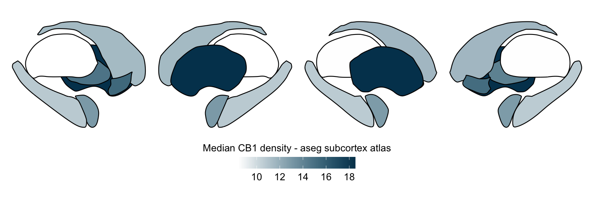<!-- -->

``` r
# Clean up downloaded file
file.remove("CB1_mean.nii.gz")
```

    ## [1] TRUE

### Applying multiple atlases simultaneously

`parcel_segstats` accepts a vector of atlas names, running the
parcellation for each and concatenating results into one data frame with
an `Atlas` column. This makes it straightforward to compare how regional
patterns differ across parcellation schemes.

As long as your empirical volume is in one of the two supported MNI
spaces, you can flexibly mix any combination of atlases and summary
statistics in a single function call.

Here we compute the mean GABA<sub>A</sub>-α1 receptor subunit density
across all twelve atlases included in the package:

``` r
# Define subcortical atlases
all_atlases <- c('aseg_subcortex', 'Melbourne_S1', 'Melbourne_S2',
                 'Melbourne_S3', 'Melbourne_S4', 'AICHA_subcortex',
                 'Brainnetome_subcortex', 'CIT168_subcortex', 'Thalamus_HCP',
                 'Thalamus_THOMAS', 'Brainstem_Navigator', 'SUIT_cerebellar_lobule')

# Define file path for download
GABAa1_density_URL <- "https://github.com/netneurolab/hansen_receptorvar/blob/main/data/PET_volumes/GABAa1_ro154513_hc23_chang_mean.nii.gz?raw=true"
download.file(url = GABAa1_density_URL, destfile = "GABAa1_mean.nii.gz", mode = "wb", quiet=TRUE)
functional_map_path <- "GABAa1_mean.nii.gz"

atlas_space <- 'MNI152NLin6Asym'
func_name <- "GABA_A_a1_density"

# Extract mean values for all atlases from the GABA_A_a1 density map
# Use nearest neighbor interpolation to preserve discrete labels in the atlas
func_map_subcortical_parc_df <- parcel_segstats(input_vol = functional_map_path,
                                                atlas = all_atlases,
                                                atlas_space = atlas_space,
                                                parc_stat = mean,
                                                ignore_background = TRUE,
                                                func_name = func_name,
                                                interpolation = 'nearest')

min_func_parc_value <- min(func_map_subcortical_parc_df$value)
max_func_parc_value <- max(func_map_subcortical_parc_df$value)

# Plot each atlas with a consistent color scale
for (atlas in all_atlases) {
    this_atlas_data <- subset(func_map_subcortical_parc_df, Atlas == atlas)
    this_fill_title <- paste(func_name, "-", atlas, sep = " ")
    this_atlas_plot <- plot_subcortical_data(
        subcortex_data = this_atlas_data,
        atlas = atlas,
        value_column = 'value',
        fill_title = this_fill_title,
        hemisphere = 'both',
        vmin = min_func_parc_value,
        vmax = max_func_parc_value,
        cmap = 'plasma',
        show_legend = TRUE
    )
    print(this_atlas_plot)
}
```

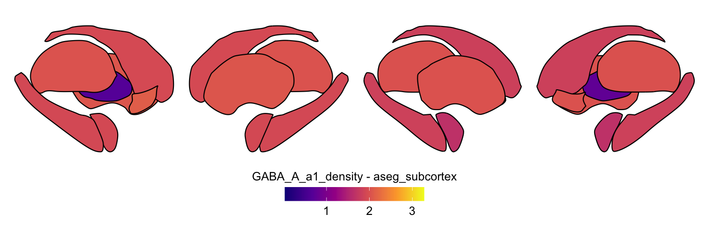<!-- -->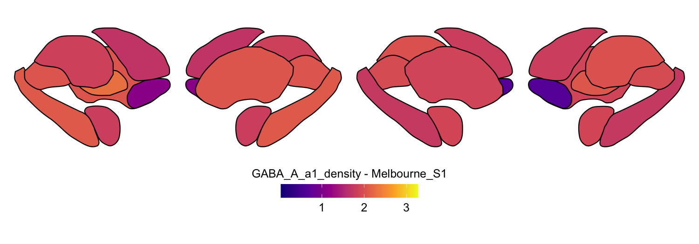<!-- -->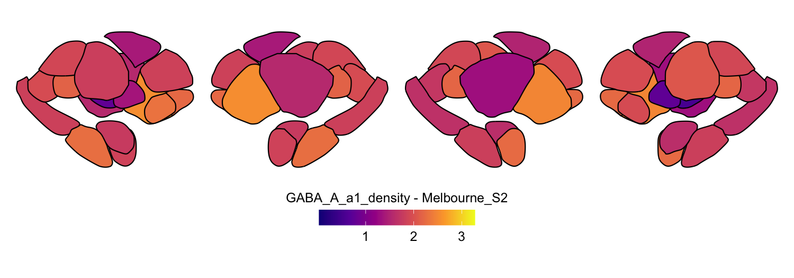<!-- -->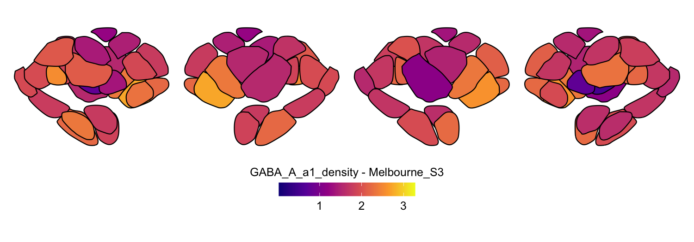<!-- -->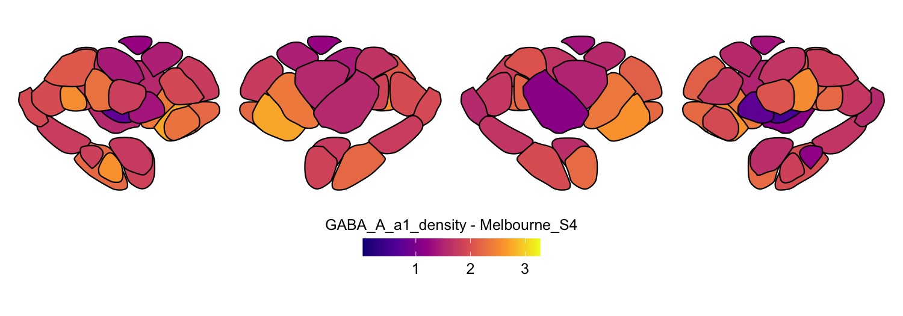<!-- -->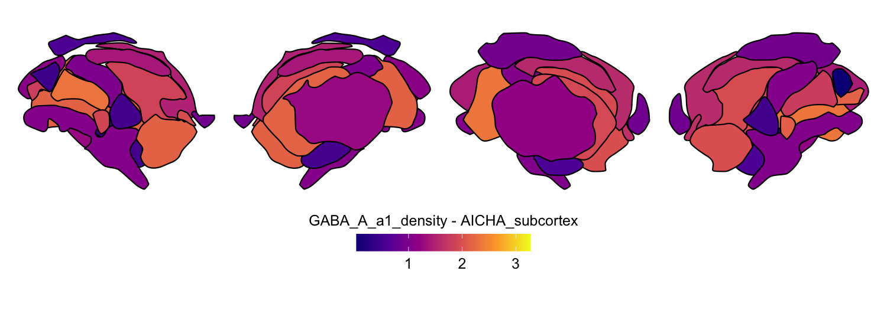<!-- -->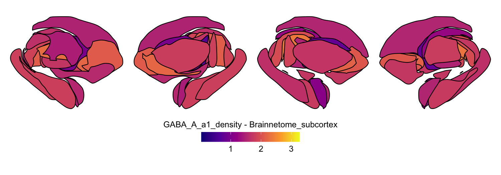<!-- -->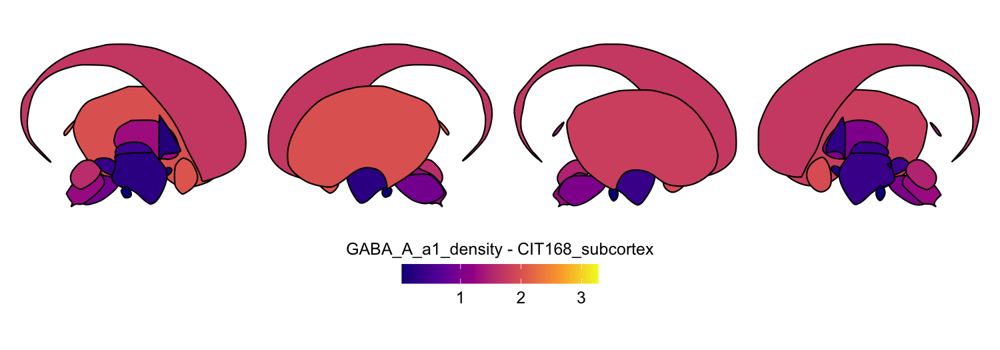<!-- -->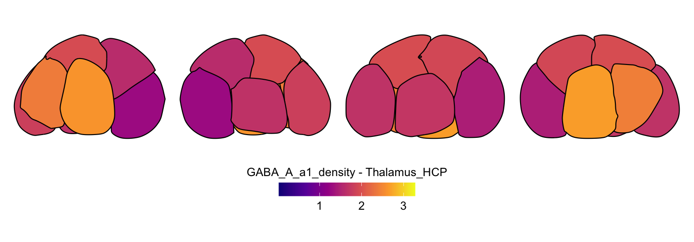<!-- -->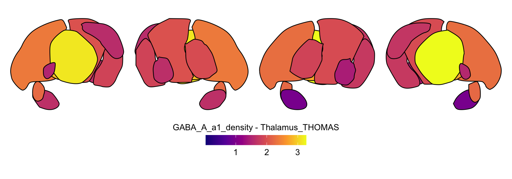<!-- -->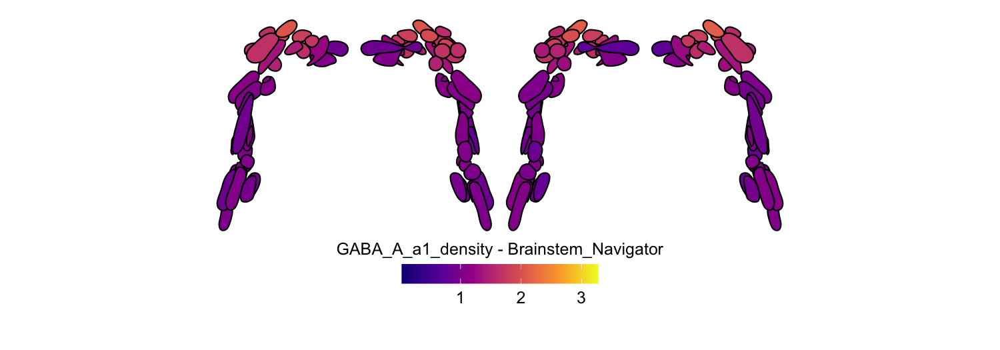<!-- --><!-- -->

## 6. Combining cortical and subcortical visualizations

Since `subcortexVisualizationR` produces `ggplot2` objects, it is
straightforward to combine subcortical and cerebellar plots with
cortical surface plots from `ggseg` using the `patchwork` package, all
within the `ggplot2` framework. This allows for direct comparison of
receptor density across cortical and non-cortical structures with a
unified color scale.

Python package users can save outputs from `plot_subcortical_data` in
their preferred file format (e.g., .png or .svg) and combine with saved
`ggseg` output from R in the image editor of their choice.

As a fully R-based example, we visualize the regional average
GABA<sub>A</sub>-α1 receptor subunit density from the previous example
in the cortex alongside the subcortex and cerebellum together. We
selected the 1000-parcel Schaefer atlas to parcellate the cerebral
cortex, the Melbourne Subcortex S4 atlas for subcortex, and the SUIT
cerebellar lobule atlas for cerebellum. Note that the color range is
consistent across all three plots, allowing for direct comparison of
receptor subunit density across the cortical and non-cortical
structures.

> **Note:** The below code chunk does not compute/visualize the real
> cortical values for the Schaefer-1000 cortical atlas, as this is
> beyond the scope of our package and is designed to be performed in
> Python using `neuromaps`.

``` r
library(ggseg)
library(ggsegSchaefer)
library(patchwork)
library(tidyverse)

# Use subcortical parcellation results from the previous code chunk
# (func_map_subcortical_parc_df, min_func_parc_value, max_func_parc_value)

# Cortical plot with ggseg
# Get Schaefer 1000-parcel atlas labels, then join with parcellated GABA_A_a1 data
# In practice, cortical parcellation would be done with neuromaps (Python) or
# a surface-based parcellation tool; here we simulate cortical values for illustration
schaefer1000_labels <- schaefer17_1000()$data$sf %>%
    as_tibble() %>%
    filter(!is.na(label)) %>%
    select(label, hemi) %>%
    distinct()

set.seed(42)
cortical_sim_data <- schaefer1000_labels %>%
    mutate(value = runif(n(),
                         min = min_func_parc_value,
                         max = max_func_parc_value))

cortex_p <- cortical_sim_data %>%
    ggplot() +
    geom_brain(atlas = schaefer17_1000(), mapping = aes(fill = value),
               colour = "black", linewidth = 0.1) +
    ggtitle("Schaefer-1000 Cortex") +
    labs(fill = 'Mean GABAa1 Signal (VT)') +
    scale_fill_viridis_c(limits = c(min_func_parc_value, max_func_parc_value),
                         na.value = 'gray80', option = 'plasma') +
    theme_void() +
    guides(fill = guide_colorbar(barwidth = unit(5, "cm"),
                                  barheight = unit(0.5, "cm"),
                                  title.position = "top", title.hjust = 0.5)) +
    theme(legend.position = 'bottom', plot.title = element_text(hjust = 0.5))

# Melbourne S4 subcortex plot
subcortex_p <- plot_subcortical_data(
    subcortex_data = subset(func_map_subcortical_parc_df, Atlas == "Melbourne_S4"),
    atlas = "Melbourne_S4", hemisphere = "both",
    value_column = 'value', vmin = min_func_parc_value,
    vmax = max_func_parc_value, cmap = 'plasma', show_legend = FALSE) +
    ggtitle("Melbourne S4 Subcortex") +
    theme(plot.title = element_text(hjust = 0.5))

# SUIT cerebellum plot
cerebellum_p <- plot_subcortical_data(
    subcortex_data = subset(func_map_subcortical_parc_df, Atlas == "SUIT_cerebellar_lobule"),
    atlas = "SUIT_cerebellar_lobule", hemisphere = "both",
    value_column = 'value', vmin = min_func_parc_value,
    vmax = max_func_parc_value, cmap = 'plasma', show_legend = FALSE) +
    ggtitle("SUIT Cerebellum") +
    theme(plot.title = element_text(hjust = 0.5))

# Use patchwork to combine the plots; titles can be further adjusted in Inkscape
plot_design <- "AAA
                BBC"
wrap_plots(A = cortex_p, B = subcortex_p, C = cerebellum_p,
           design = plot_design, heights = c(0.6, 0.4))
```

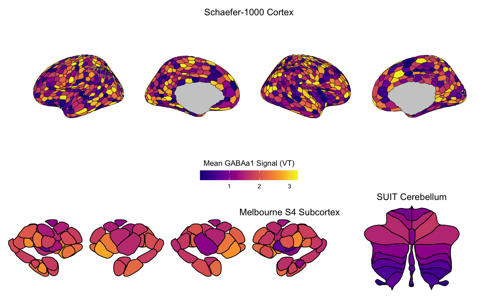<!-- -->
