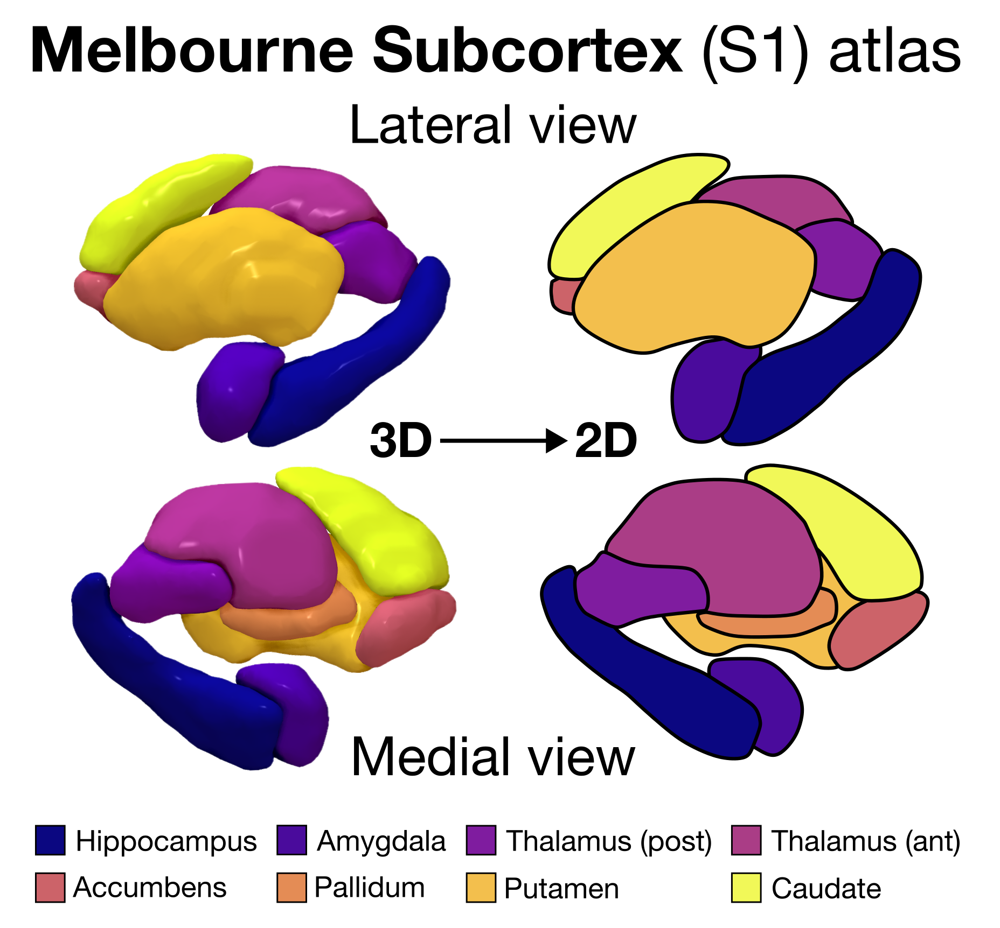
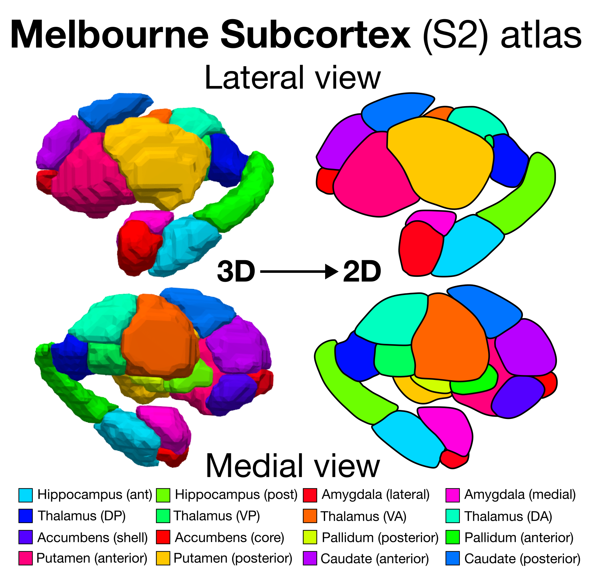

## aseg (FreeSurfer)

Reference: [Fischl et al. *Neuron* (2002)](https://www.sciencedirect.com/science/article/pii/S089662730200569X).

## Melbourne Subcortex Atlas (S1)

Reference: [Tian et al. *Nature Neuroscience* (2020)](https://www.nature.com/articles/s41593-020-00711-6).

## Melbourne Subcortex Atlas (S2)

Reference: [Tian et al. *Nature Neuroscience* (2020)](https://www.nature.com/articles/s41593-020-00711-6).

## AICHA subcortical atlas

Reference: [Joliot et al. *J Neurosci Methods* (2015)](https://pubmed.ncbi.nlm.nih.gov/26213217/).

## Brainnetome subcortical atlas

Reference: [Fan et al. *Cerebral Cortex* (2016)](https://pmc.ncbi.nlm.nih.gov/articles/PMC4961028/).

## Thalamus Nuclei (HCP) atlas

Reference: [Najdenovska et al. *Scientific Data* (2018)](https://www.nature.com/articles/sdata2018250).

