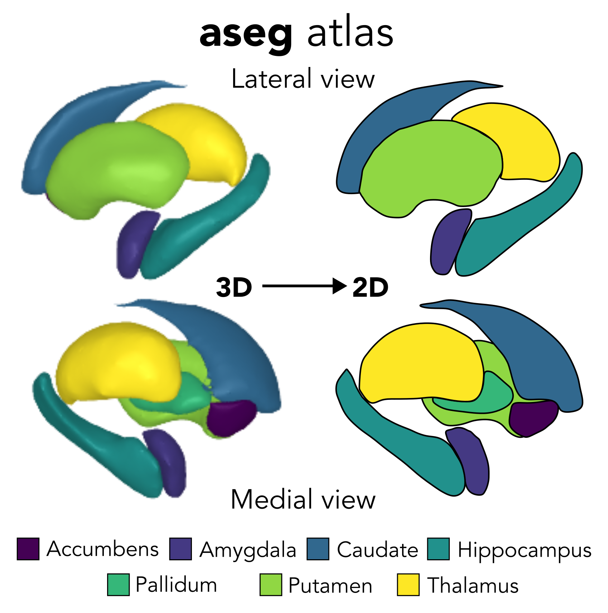
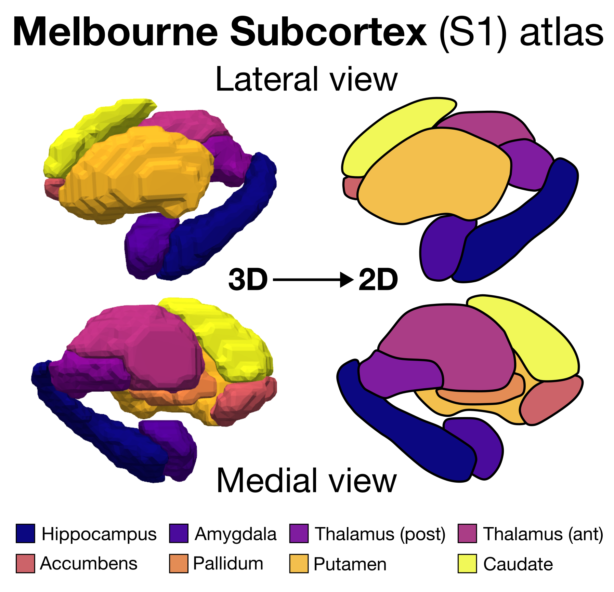
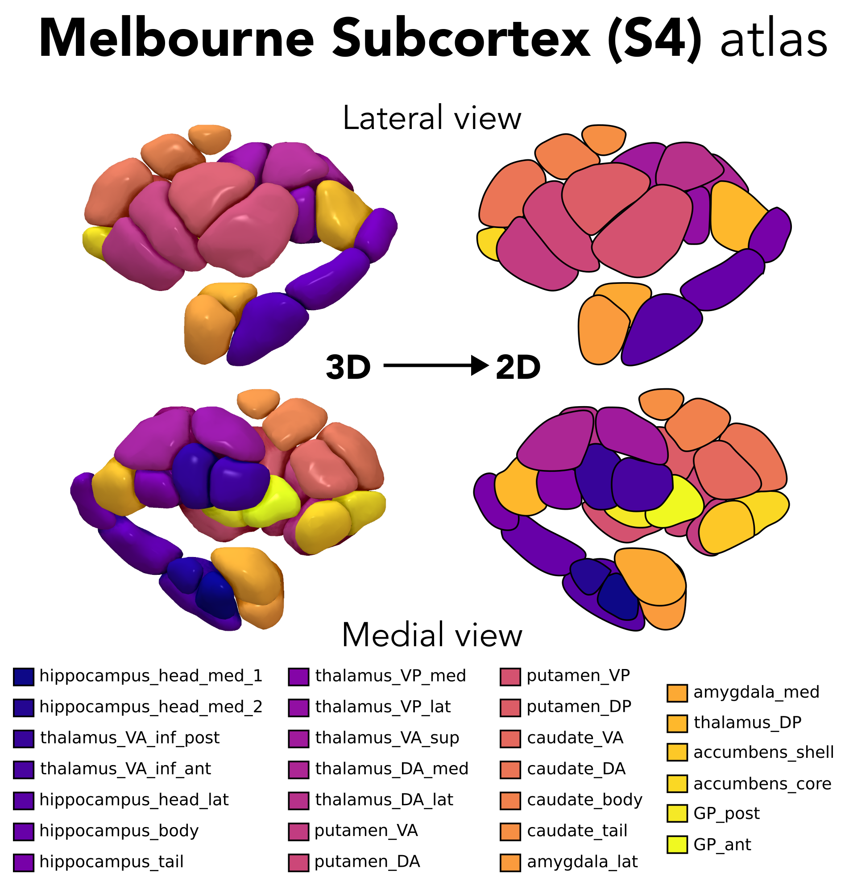
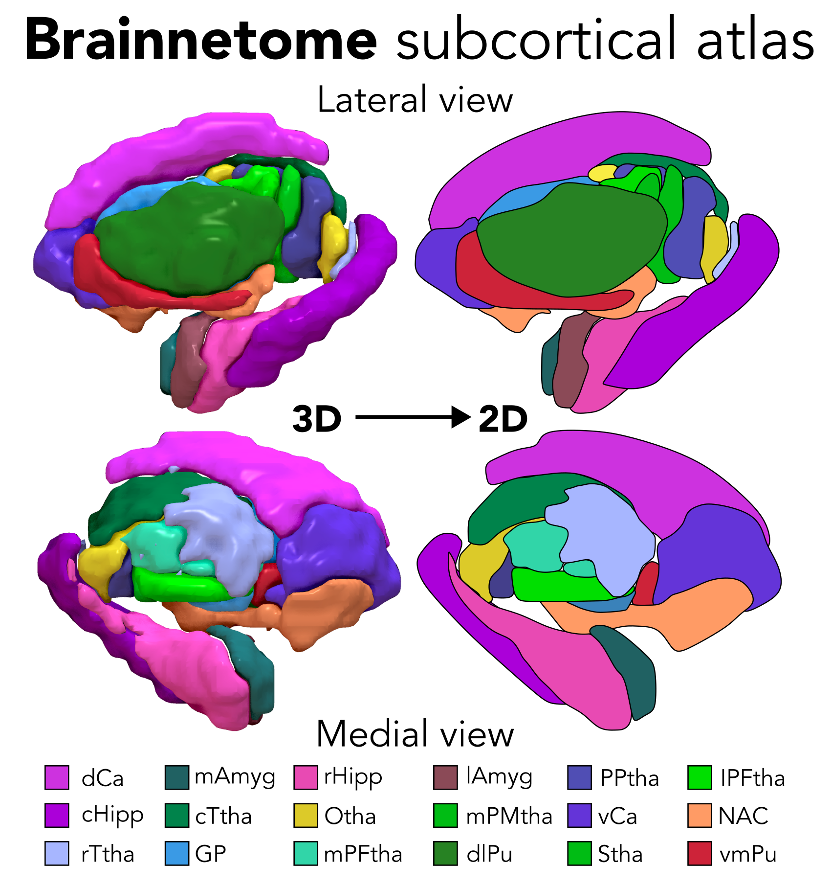
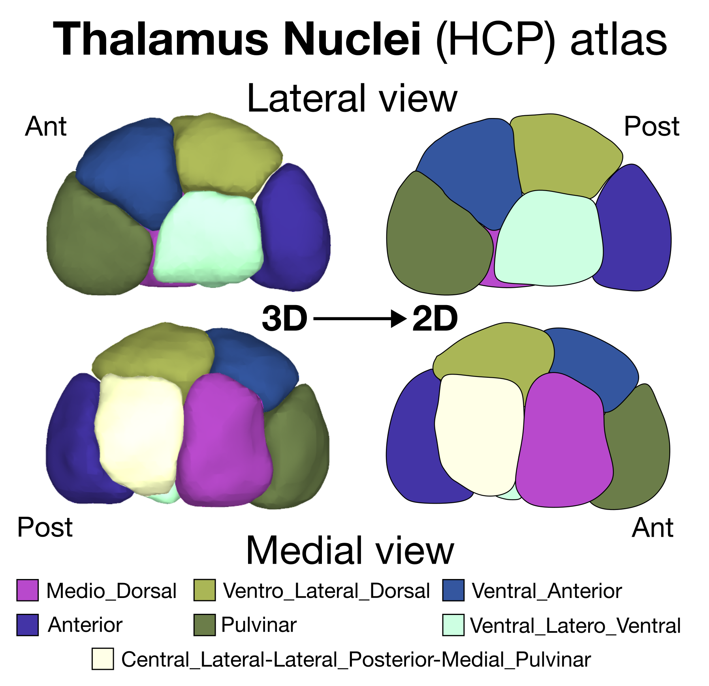
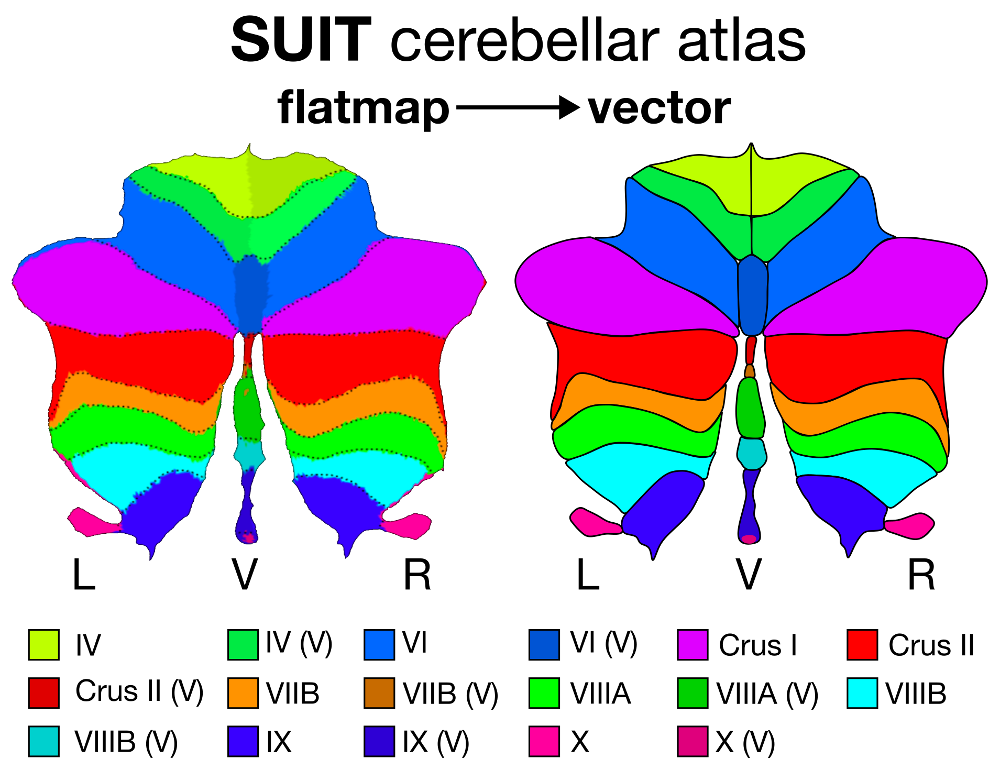

# Information about the included subcortical atlases
## aseg (FreeSurfer)

Reference: [Fischl et al. *Neuron* (2002)](https://www.sciencedirect.com/science/article/pii/S089662730200569X). 

Atlas name keyword: `aseg`

Region names: accumbens, amygdala, caudate, hippocampus, pallidum, putamen, thalamus

{ width="60%" }

## Melbourne Subcortex Atlas (S1)

Reference: [Tian et al. *Nature Neuroscience* (2020)](https://www.nature.com/articles/s41593-020-00711-6).

Atlas name keyword: `Melbourne_S1`

Region names: accumbens, amygdala, caudate, hippocampus, pallidum, putamen, thalamus_anterior, thalamus_posterior

{ width="60%" }

## Melbourne Subcortex Atlas (S2)

Reference: [Tian et al. *Nature Neuroscience* (2020)](https://www.nature.com/articles/s41593-020-00711-6).

Atlas name keyword: `Melbourne_S2`

Region names: accumbens_core, accumbens_shell, amygdala_lateral, amygdala_medial, caudate_anterior, caudate_posterior, hippocampus_anterior, hippocampus_posterior, pallidum_anterior, pallidum_posterior, putamen_anterior, putamen_posterior, thalamus_DA, thalamus_DP, thalamus_VA, thalamus_VP

{ width="60%" }

## Melbourne Subcortex Atlas (S3)

Reference: [Tian et al. *Nature Neuroscience* (2020)](https://www.nature.com/articles/s41593-020-00711-6).

Atlas name keyword: `Melbourne_S3`

Region names: accumbens_core, accumbens_shell, amygdala_lateral, amygdala_medial, caudate_anterior, caudate_posterior, hippocampus_anterior, hippocampus_posterior, pallidum_anterior, pallidum_posterior, putamen_anterior, putamen_posterior, thalamus_DA, thalamus_DP, thalamus_VA, thalamus_VP

{ width="60%" }

## Melbourne Subcortex Atlas (S4)

Reference: [Tian et al. *Nature Neuroscience* (2020)](https://www.nature.com/articles/s41593-020-00711-6).

Atlas name keyword: `Melbourne_S4`

Region names: accumbens_core, accumbens_shell, amygdala_lateral, amygdala_medial, caudate_anterior, caudate_posterior, hippocampus_anterior, hippocampus_posterior, pallidum_anterior, pallidum_posterior, putamen_anterior, putamen_posterior, thalamus_DA, thalamus_DP, thalamus_VA, thalamus_VP

{ width="60%" }

## AICHA subcortical atlas

Reference: [Joliot et al. *J Neurosci Methods* (2015)](https://pubmed.ncbi.nlm.nih.gov/26213217/).

Atlas name keyword: `AICHA`

Region names: Amygdala-1,  Caudate-1,  Caudate-2,  Caudate-3,  Caudate-4,  Caudate-5,  Caudate-6,  Caudate-7,  Pallidum-1,  Putamen-2,  Putamen-3,  Thalamus-1,  Thalamus-2,  Thalamus-3,  Thalamus-4,  Thalamus-5,  Thalamus-6,  Thalamus-7,  Thalamus-8,  Thalamus-9 

{ width="60%" }

## Brainnetome subcortical atlas

Reference: [Fan et al. *Cerebral Cortex* (2016)](https://pmc.ncbi.nlm.nih.gov/articles/PMC4961028/).

Atlas name keyword: `Brainnetome`

Region names: GP, NAC, Otha, PPtha, Stha, cHipp, cTtha, dCa, dlPu, lAmyg, lPFtha, mAmyg, mPFtha, mPMtha, rHipp, rTtha, vCa, vmPu

{ width="60%" }

## Thalamus Nuclei (HCP) atlas

Reference: [Najdenovska et al. *Scientific Data* (2018)](https://www.nature.com/articles/sdata2018270).

Atlas name keyword: `Thalamus_Nuclei_HCP`

Region names: Anterior, Central_Lateral-Lateral_Posterior-Medial_Pulvinar, Medio_Dorsal, Pulvinar, Ventral_Anterior, Ventral_Latero_Dorsal, Ventral_Latero_Ventral

{ width="60%" }

## SUIT cerebellar atlas

Reference: [Diedrichson. *Neuroimage* (2006)](https://doi.org/10.1016/j.neuroimage.2006.05.056).

Atlas name keyword: `SUIT`

Region names: I_IV, V, VI, VI_vermis, Crus_I, Crus_II, Crus_II_vermis, VIIb, VIIb_vermis, VIIIa, VIIIa_vermis, VIIIb, VIIIb_vermis, IX, IX_vermis, X, X_vermis

{ width="60%" }