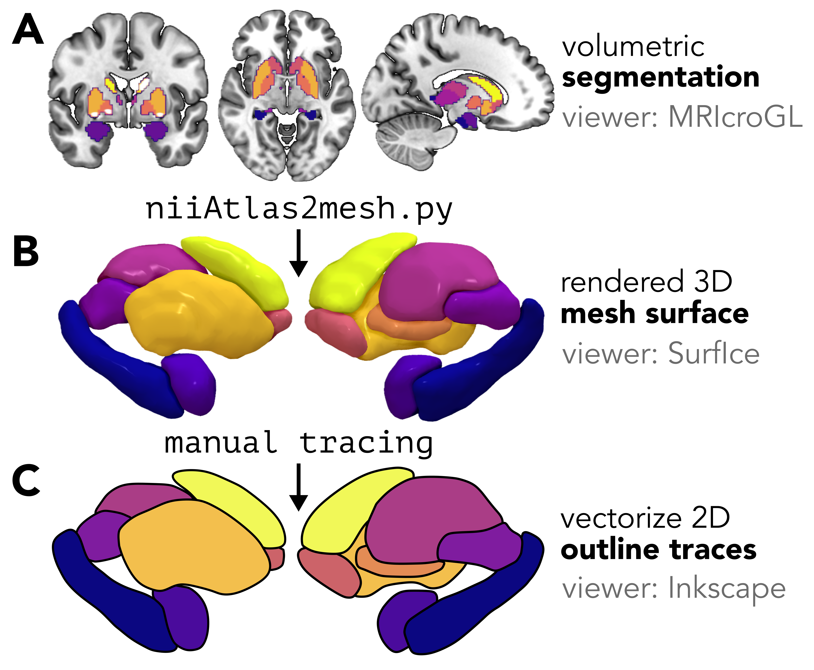
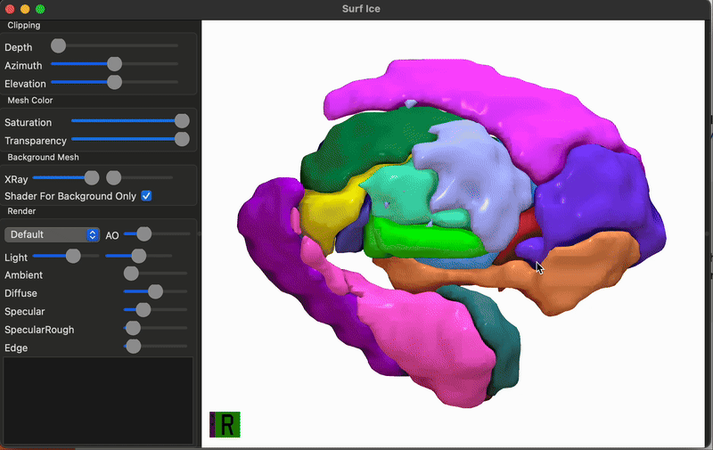
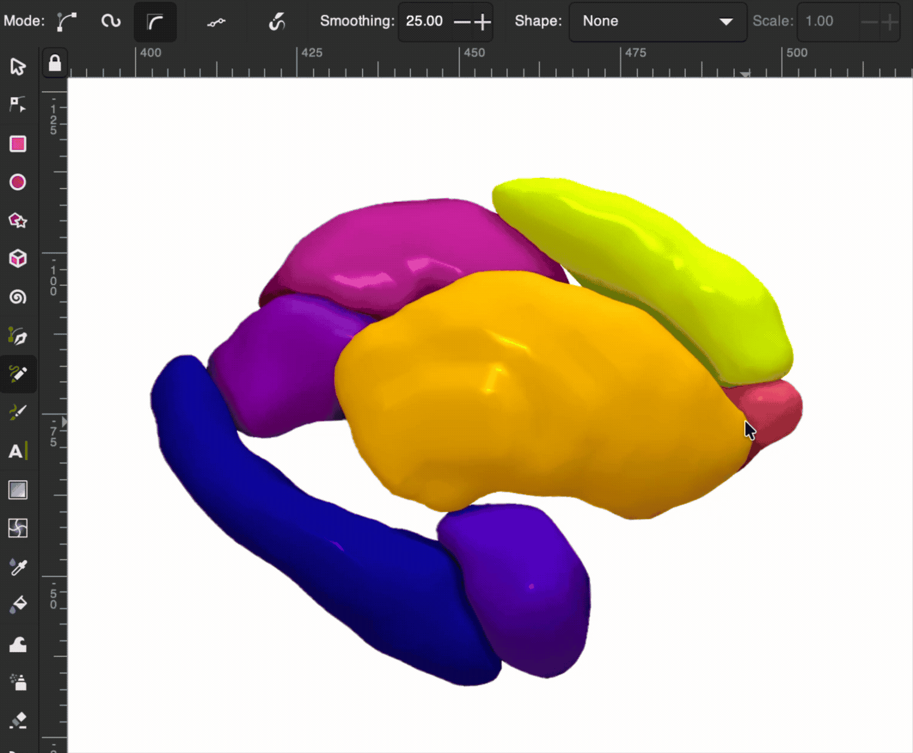
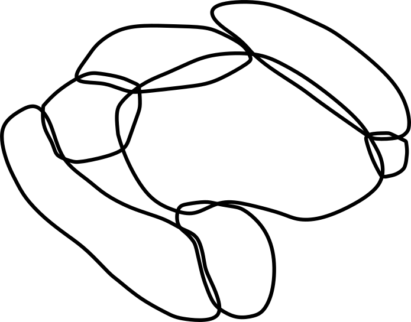
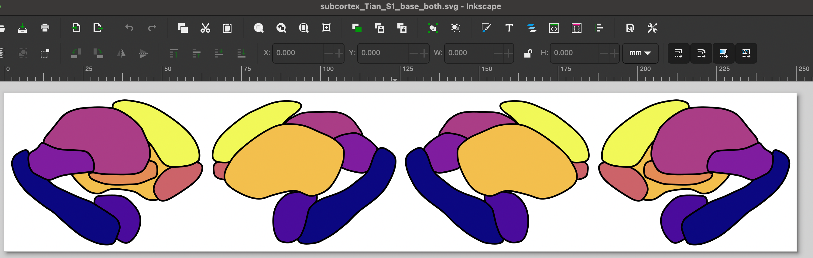

{ width="70%" }

## Overview

While this package comes with [nine subcortical and cerebellar atlases](https://anniegbryant.github.io/subcortex_visualization/atlas_info/), you can add any new segmentation (cortical or non-cortical) through three-dimensional (3D) mesh rendering and manual tracing.
We have a dedicated folder for a custom segmentation pipeline that will walk you through the two key steps:  

1. Rendering a series of surface meshes from your parcellation atlas (starting from a .nii.gz volume), using the [`surfice_atlas`](https://github.com/neurolabusc/surfice_atlas) visualization software developed by the lab of [Professor Chris Rorden](https://github.com/neurolabusc) (see [Rorden 2025, *Nature Methods*](https://www.nature.com/articles/s41592-025-02764-6)); and 
2. Tracing the outline of each region in the rendered mesh in vector graphic editing software (we use [Inkscape](https://inkscape.org/) in the tutorial as a powerful and free option), to yield a two-dimensional image of your atlas in scalable vector graphic (.svg) format.

If you use a particular segmentation atlas in your research and would like to visualize data in that atlas in two dimensions, you can follow along with this guide.
These are the exact same steps we implemented to generate the segmentation visuals included in this visualization package for all atlases.

## 🧠 Step 1. Creating and visualizing a custom triangulated mesh from a volumetric segmentation/parcellation

First, you'll want to convert from your 3D segmentation atlas (stored as a NIFTI image) to a triangulated mesh rendering.
There are some very helpful existing resources out there on this step:  

* Madan (2015) provides a comprehensive tutorial for constructing 3D surface meshes from a volumetric atlas using a combination of ITK-SNAP and ParaView programs, which are helpful for users who prefer a graphical user interface (GUI)-based approach 
* The [NiiVue package](https://niivue.com/demos/features/meshes.html) offers excellent resources for web-based surface mesh rendering; for example, the SUIT probabilistic cerebellar lobule atlas is rendered as a mesh with interactive viewing options at [https://niivue.com/demos/features/mesh.atlas.suit.html](https://niivue.com/demos/features/mesh.atlas.suit.html)

For users who prefer a **programmatic Python-based approach**, we will walk through a solution developed by the [lab of Professor Chris Rorden](https://github.com/rordenlab/) that makes use of two of their Python scripts:  

1. [niiAtlas2mesh.py](https://github.com/rordenlab/pythonScripts/blob/main/atlas2mz3/niiAtlas2mesh.py)
2. [combinemz3.py](https://github.com/rordenlab/pythonScripts/blob/main/atlas2mz3/combinemz3.py)

This method will generate one color-coded 3D mesh file (`.mz3`) for your segmentation, which can then be rendered interactively in the [`Surf Ice`](https://github.com/neurolabusc/surf-ice) GUI software (described in more detail in [Rorden *Nature Methods*, 2025](https://www.nature.com/articles/s41592-025-02764-6)).

### Generating the .mz3 file in Python

We provide a straightforward python script, `volume_to_mesh_mz3.py`, that allows you to pass in your segmentation volume (in NIfTI format) and generates the `.mz3` color-coded 3D surface mesh. 
It can be run as follows:

```Python
python volume_to_mesh_mz3.py \
    --input_volume Tian_Subcortex_S1_3T_1mm.nii.gz \
    --output_path mesh_outputs/ --out_file Tian_Subcortex_S1_3T_1mm.mz3 \
    --index_max 8 --colors plasma_8_colors.txt --delete_mz3
```

Where: 

* `input_volume` is your volumetric segmentation (here, we use the S1 resolution from the Melbourne Subcortical Atlas as an example; see [Tian et al. *Nature Neuroscience*, 2020](https://www.nature.com/articles/s41593-020-00711-6))
* `output_path` (optional) is a working directory where individual `.mz3` files can be saved per region; these can be deleted.
* `out_file` (optional) is the name for your final generated `.mz3` file. 
* `index_max` (optional) is the maximum segmentation index you want to use; for example, if you have eight regions per hemisphere, setting this to 8 means the mesh will only be for one hemisphere (Right hemisphere in this case). You can also set an `index_min` for the same purpose.
* `colors` (optional) is an RGBA color lookup table for custom control over the mesh colors. 
* `delete_mz3` is an optional flag to delete intermediate `.mz3` files that were generated for each region in `output_path`.

The default color scheme comes from [`colors.txt`](https://github.com/rordenlab/pythonScripts/blob/main/atlas2mz3/colors.txt), but it's very straightforward to make your own custom colormap. 
Any colormap can be used, and the number of discrete colors to sample should be set to match the number of subregions in the given atlas and number of hemispheres---for example, for the left subcortex in the Melbourne S2 atlas, 16 colors should be sampled.
Here's how to select 8 evenly-spaced shades across the `plasma` colormap from `Matplotlib`, which we used for the Melbourne S1 right-hemisphere surface example:

```Python
import numpy as np
import matplotlib

cmap = matplotlib.colormaps.get_cmap('plasma') # Use plasma colormap
colors = cmap(np.linspace(0, 1, 8)) # Sample 8 colors
rgb_colors = colors[:, :3] # Extract RGB (no alpha)
rgb_256 = (rgb_colors * 256).astype(int) # 0-256 scaling
np.savetxt('my_colors.txt', rgb_256, fmt='%d') # Save colors to .txt file
```

Generally speaking, we recommend separating out the two hemispheres for maximum visibility along the medial face (i.e., so medial areas are not obstructed by the opposite hemisphere).
If there are substantial structural differences between the left and right hemispheres, this process should be repeated separately for each hemisphere; otherwise, the traced regions can simply be mirrored along the horizontal axis, though one should still use the appropriate region name suffixes as discussed below.

### Visualizing the 3D mesh

Once you have your combined 3D mesh in `.mz3` format (in our example, that's `Tian_Subcortex_S1_3T_1mm.mz3`), you can visualize this using the [`Surf Ice`](https://github.com/neurolabusc/surf-ice) GUI software.

Boot up Surf Ice and open the `Tian_Subcortex_S1_3T_1mm.mz3` file (using File > Open to select Tian_Subcortex_S1_3T_1mm.mz3), and you should have a color-coded three-dimensional mesh rendered on your screen.

{ width="90%" }

If you use this method, we recommend rotating the object until you reach the desired angle(s) for generating your two-dimensional atlas, then taking a screenshot from the medial and lateral perspectives.


## 🎨 Step 2. Tracing the outline of each region in vector graphic editing software

### Creating outlines for each region

Next, pour yourself a big mug of coffee to sit and trace the outline of each region in [Inkscape](https://inkscape.org/) (or a similar vector graphic editing program) ☕️
We'll walk you through the steps using Inkscape.

Open up a new image (.svg) in Inkscape, and import the PNG snapshot generated from the above rendered mesh by either clicking `⌘+I` (Mac) or `Ctrl+I` (Windows), or `File > Import`.
We'll use the 'Freehand lines' tool for tracing, which looks like the following along your toolbar:

{ width="50%" }

And then go ahead and trace your first region in your image!
We recommend setting 'Smoothing' in your top toolbar to around 20-25 (we use 25.0 in this example), which means that you can do a pretty quick first pass at tracing each region and the path won't stick to every bump you draw.

{ width="90%" }

Once you finish your first trace, if you want to edit any of the points in the path, just double-click on the black line and you can click and drag the points to adjust their spacing.
Rinse and repeat: go ahead and trace the outline for all of the regions in your atlas.
Once you finish, when you take away the 3D mesh PNG underneath, you should have a set of outlines that resemble a minimalist aesthetic line-art tattoo like so:

{ width="50%" }

### Labeling each region in the SVG metadata

After you finish tracing the outline for each region, you can store the name of that region along with the face (medial or lateral) and hemisphere (right or left) to identify that region programmatically in python.
In Inkscape, you can accomplish this by selecting a given region (here, the left putamen shown on the lateral face).
In the 'Object Properties' pane shown on the right, in the 'Title' text box, you should then put the name of the region (e.g., 'putamen'), face (e.g., 'lateral'), and hemisphere (e.g., 'R'), all as one string separated by underscores, as shown in the screenshot.
In other words, for the highlighted region, its title should be 'putamen_lateral_R':

{ width="80%" }

Once you add the title to each region, congrats, you've finished creating the vector graphic for the given hemisphere for your custom atlas!

### Repeating for the other hemisphere

You may notice that the above SVG image is saved as 'Melbourne_S1_R.svg', which indicates that this file corresponds to the Melbourne Subcortex Atlas at granularity level S1 in the Right hemisphere (R).

If your atlas is left-right symmetric, you can just copy-paste the SVG objects into a new file named e.g., 'Melbourne_S1_L.svg', making sure you (1) flip the image along the $y$-axis (i.e., left-right mirror) and update each region's Title to end with '_L' rather than '_R'.

### Combining the left and right hemispheres into one image

Once you have both hemispheres traced, the last step here is to copy-paste the left and right hemisphere vector graphics into the same image for an SVG corresponding to both hemispheres, named e.g. 'Melbourne_S1_both.svg'.
Make sure all the individual regions have appropriate Title text fields corresponding to the region name, face, and hemisphere.



## 🗂️ Organizing the file structure correctly for your custom atlas

Once you have all your regions traced in the left and right hemispheres for your segmentation, copy the SVGs to the `subcortex_visualization/data/` folder (for the Python package) and the `subcortexVisualizationR/inst/extdata/` folder (for the R package) with the following structure:

```bash
# Python package file structure
subcortex_visualization/
    data/
        - My_Atlas_both.svg
        - My_Atlas_L.svg
        - My_Atlas_R.svg

# R package file structure
subcortexVisualizationR/
    inst/
        extdata/
        - My_Atlas_both.svg
        - My_Atlas_L.svg
        - My_Atlas_R.svg
```


### 🔎 Lookup tables to indicate the order for drawing regions

Home stretch, you're almost done 🏃‍♀️

One of the last steps to get plotting with your custom atlas to create a lookup table for each of the three SVG images (left, right, and both hemispheres).
Each table, in .csv format, should have the following four columns:  

1. `region`: name of the region (e.g., 'accumbens')
2. `face`: which face to plot (e.g., 'lateral')
3. `plot_order`: in which order should this region be plotted? A value of 1 means this region will be drawn first (i.e., on the bottom) and higher values mean the region will be drawn higher in the stack (i.e., closer to the top). This is only relevant if some regions are overlapping and you care about plotting order.
4. `Hemisphere`: which hemisphere the corresponding region belongs to (should be all 'L' for left hemisphere and 'R' for right hemisphere).

Take a look at the examine lookup tables provided for the Melbourne Subcortex Atlas S1 segmentation in the [left hemisphere], [right hemisphere], and both hemispheres to see exactly how these files are organized.
In the case of the Melbourne Subcortex Atlas S1 subcortical atlas, this corresponds to three lookup table files (linked to the actual files for this atlas for reference):

* [Melbourne_S1_L_ordering.csv](https://github.com/anniegbryant/subcortex_visualization/blob/main/subcortex_visualization/data/Melbourne_S1_L_ordering.csv)
* [Melbourne_S1_R_ordering.csv](https://github.com/anniegbryant/subcortex_visualization/blob/main/subcortex_visualization/data/Melbourne_S1_R_ordering.csv)
* [Melbourne_S1_both_ordering.csv](https://github.com/anniegbryant/subcortex_visualization/blob/main/subcortex_visualization/data/Melbourne_S1_both_ordering.csv)

## Re-installing the package with the new atlas

And with that, you'll just need to reinstall the Python and/or R package once you've added your new vector graphics and lookup tables! 
That can be accomplished by simply navigating to the base level of this repository and running the following for Python:

```bash 
# Change to where you've cloned this repo
cd /path/to/github/subcortex_visualization 

# To reinstall the subcortex-visualization package
python3 -m pip install . 
```

And for R, run from R (in either the terminal or Rstudio):

```R 
# Change to where you've cloned this repo
setwd("code/subcortexVisualizationR")

# TO reinstall the subcortexVisualizationR package
remotes::install_local(".")
```
