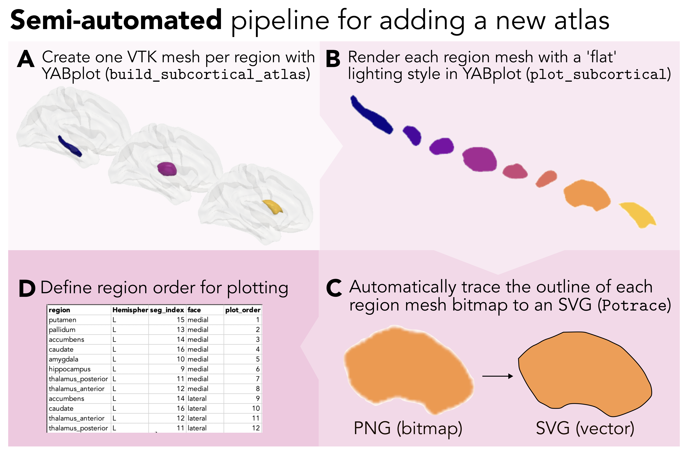
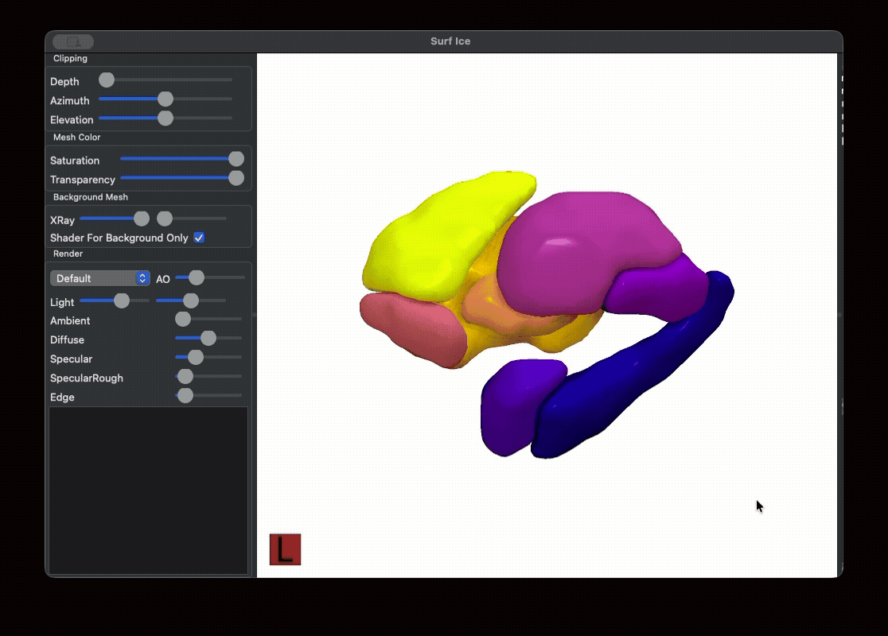
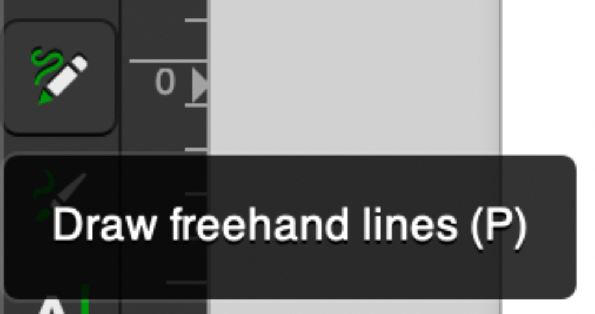
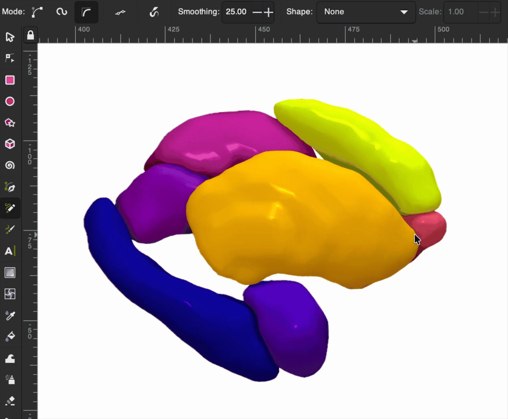
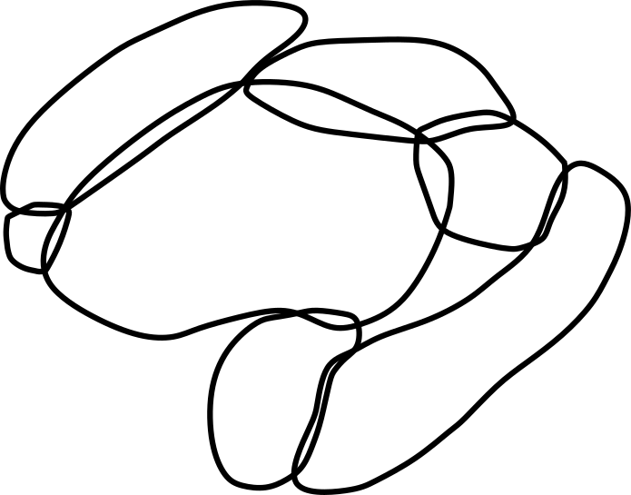
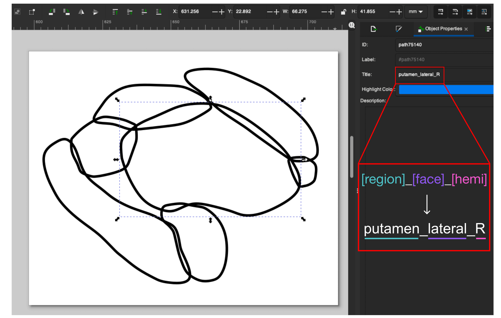
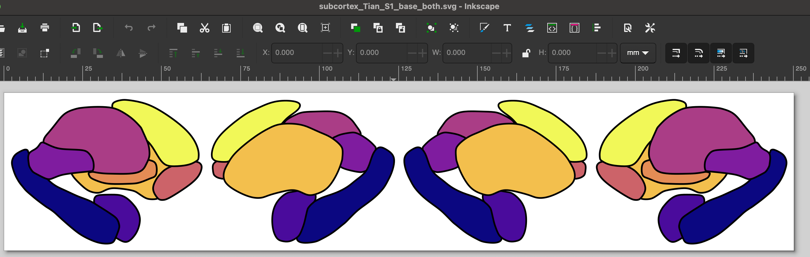

{ width="90%" }

## Overview

While this package comes with [twelve subcortical and cerebellar atlases](https://anniegbryant.github.io/subcortex_visualization/atlas_info/), you can add any new segmentation (cortical or non-cortical) by converting your volumetric atlas into a two-dimensional scalable vector graphic (SVG) scaffold.
This scaffold can then be used with the same `plot_subcortical_data` function as the pre-packaged atlases.

We'll walk through two complementary workflows for creating this vector scaffold (each with its own pros and cons), which are both available in the [`adding_new_atlases/`](https://github.com/anniegbryant/subcortex_visualization/tree/main/adding_new_atlases/) directory of the repository:

1. **[Semi-automated pipeline](#-semi-automated-pipeline)**: This option will use Python scripts to automatically trace per-region surface meshes, rendered by the fantastic [YABplot](https://github.com/teanijarv/yabplot) package into SVGs using the [Potrace](http://potrace.sourceforge.net/) algorithm, as implemented in the [potracer](https://github.com/tatarize/potrace) Python package.
This option is (much) faster and is fully scriptable, making it a more scalable option for atlases with a moderate number of clearly separable regions.
2. **[Manual pipeline](#️-manual-pipeline)**: With this option, you'll interactively render a composite surface mesh in [Surf Ice](https://github.com/neurolabusc/surf-ice) and trace each region by hand in [Inkscape](https://inkscape.org/). 
This is more time-consuming but offers finer control, which can be particularly helpful for atlases with many small, closely-packed nuclei.
Both pipelines produce SVG files and region-ordering CSV lookup tables that integrate directly with `plot_subcortical_data`.

!!! important "Choosing your approach"
    For most atlases, we'd recommend starting with the semi-automated pipeline and then reviewing the output SVGs.
    You can always manually edit specific regions in Inkscape (or your preferred vector graphic editing software, like Adobe Illustrator or Blender) after the semi-automated pipeline as a final quality control step.

---

## 🤖 Semi-automated pipeline

### Overview

The semi-automated pipeline automates the most labor-intensive part of vectorization (i.e., tracing each brain region), leaving only one manual step: defining the z-stacking (layering) order in a short CSV table (hence the description 'semi-automated').
All code for this pipeline can be found at [https://github.com/anniegbryant/subcortex_visualization/tree/main/adding_new_atlases/semi_automated_pipeline_code](https://github.com/anniegbryant/subcortex_visualization/tree/main/adding_new_atlases/semi_automated_pipeline_code).
The pipeline consists of four steps:

1. Build a per-region 3D surface mesh with `build_subcortical_atlas` from [YABplot](https://github.com/teanijarv/yabplot)
2. Render each region separately as a PNG with a transparent background
3. Automatically trace each PNG outline to an SVG using the [Potrace](http://potrace.sourceforge.net/) algorithm
4. Create region-ordering CSV files to specify the z-stacking order for proper layering in the final figure

{ width="90%" }

### Prerequisites

Install the required Python packages before running the pipeline:

```bash
pip install yabplot potracer svgpath2mpl lxml Pillow
```

You'll also need the `subcortex_visualization` repository cloned locally to integrate your newly vectorized atlas with package functionality (see [Installation](installation.md)).

### Required inputs

The pipeline requires two input files:

1. **Atlas NIfTI file** (`.nii.gz`): The volumetric segmentation of your atlas in NIfTI format, where each unique integer value corresponds to a distinct region.
2. **Lookup text file** (`.txt`): A plain-text table mapping each integer region index to its name, with one entry per line in the format `<index> <region_name>`. A variety of hemisphere indicators are recognized and accepted; for example, the left hemisphere can be recognized with '-lh', '-LH', '_lh', '_LH', or '-L' at the end of the region name. The region index needs to appear in two columns, one on either side of the region name (i.e., second column in the below example).

Example lookup file contents:

```
1 hippocampus-lh 1
2 amygdala-lh 2
3 hippocampus-rh 3
4 amygdala-rh 4
```

The atlas NIfTI and lookup files should be placed together in a directory under `atlas_info/original_space/<atlas_name>/`:

```
atlas_info/
  original_space/
    My_Atlas/
      - My_Atlas.nii.gz
      - My_Atlas_lookup.txt
```

### 🧠 Step 1. Building a 3D surface mesh for each region

The first step uses `yab.build_subcortical_atlas` from [YABplot](https://github.com/teanijarv/yabplot) to extract a per-region surface mesh from the NIfTI segmentation volume.
Internally, this applies a marching cubes algorithm to identify the surface boundary of each region, followed by Laplacian mesh smoothing to reduce voxel-boundary artifacts.

Two smoothing parameters can be tuned:

- `smooth_i`: The number of Laplacian smoothing iterations (default: 20)
- `smooth_f`: Smoothing factor per iteration, between 0 and 1 (default: 0.7)

Higher values yield smoother meshes, but may erode fine details in small nuclei.
The resulting per-region meshes are saved as `.vtk` files in a `meshes/` subdirectory inside your atlas output directory.

### 🎨 Step 2. Rendering each region as a PNG

Each per-region mesh is rendered separately using `plot_subcortical` from YABplot with the `flat` lighting style and no cortical surface overlay, producing a PNG image with a transparent background.
The `flat` style produces a uniform silhouette without specular highlights, which is best for clean Potrace tracing in the next step.

Renderings are produced for all six standard views:

- `left_medial`, `left_lateral`
- `right_medial`, `right_lateral`
- `superior`, `inferior`

A composite reference image showing all regions together is also saved to the output directory, which is particularly useful as a visual guide when defining the region layering order in Step 4.

### ✏️ Step 3. Automatically tracing each PNG to an SVG

Each per-region PNG is converted to an SVG outline using the [Potrace](http://potrace.sourceforge.net/) algorithm (via the [`potracer` Python package](https://github.com/tatarize/potrace)).
The tracing process works as follows:

1. Thresholds the PNG alpha channel at α = 128 (50% opacity) to create a binary bitmap mask
2. Passes the bitmap to Potrace, which fits a series of lines and Bézier curves to the mask boundary
3. Discards the full-canvas background rectangle that Potrace adds by default
4. Saves the resulting SVG with the appropriate fill color mapping to the given region from the chosen colormap

Three Potrace parameters can be adjusted to tailor tracing quality to your specifications:

| Parameter | Default | Effect |
|-----------|---------|--------|
| `turdsize` | 4 px | Minimum island size to trace; filters out small noise pixels |
| `alphamax` | 1.0 rad | Corner threshold; lower values produce more corners, higher values yield smoother curves |
| `opttolerance` | 0.2 | Curve-fitting tolerance; lower values follow the bitmap boundary more closely |

Colors are assigned from the specified Matplotlib colormap, with one color per unique base-region name (L/R variants share the same hue in our implementation).
If adjacent regions receive similar colors from the chosen colormap, pass `--shuffle_colors` to randomize the color assignment, which can be helpful for identifying regions and determining the ordering in the z-plane for the next step.

### 🗂️ Step 4. Defining the region layering order

Since the rendered vector graphics for each region are separate files, they need to be layered on top of each other in the correct z-order; for example, for a lateral view, regions closer to the surface need to be positioned on top of those deeper in the brain.
This comprises the only manual step in the semi-automated workflow: creating three CSV files that specify the layering order for each region in each view.

A separate CSV is required for the left hemisphere, right hemisphere, and both hemispheres together (the last of which should just be the left + right hemispheres pasted together in one CSV, though the plot order should continue numbering).
Each CSV must contain the following columns:

<!-- | Column | Description |
|--------|-------------|
| `region` | Region name matching the SVG filename (e.g. `hippocampus`) |
| `face` | View name: `medial`, `lateral`, `superior`, or `inferior` |
| `plot_order` | Integer; 1 = drawn first (bottom of the stack), higher values = drawn on top |
| `Hemisphere` | `L`, `R`, `V`, `B`, `BL`, or `BR` | -->

!!! important "A note about hemisphere annotation"
    In the above table, 'L' and 'R' correspond to the left and right hemispheres, respectively.
    'V' indicates the vermis, a midline structure exclusive to the cerebellum.
    'B' indicates a bilateral midline region, like the periaqueductal gray nucleus in the brainstem; this labeling should be used for a single-hemisphere labeling order CSV.
    'BL' and 'BR' also indicate bilateral midline regions, but these are used to disambiguate whether the region should be rendered in the left-hemisphere SVG or right-hemisphere SVG, respectively, when both hemispheres are requested.

The composite reference image saved during Step 2 is a convenient guide: regions that appear to sit on top of others in the reference image should receive higher `plot_order` values for that view.
Note that the ordering must be specified separately for each view, since a region that is anterior (and thus visible) in the lateral view may be posterior in the medial view.

These CSV files should be placed in the atlas data directory alongside the `vectors/` subdirectory:

```
# Python package file structure
subcortex_visualization/
  data/
    My_Atlas/
      - My_Atlas_both_ordering.csv
      - My_Atlas_L_ordering.csv
      - My_Atlas_R_ordering.csv
      vectors/
        - RegionA_L_lateral.svg
        - RegionA_L_medial.svg
        - RegionA_L_superior.svg
        - RegionA_L_inferior.svg
        - RegionA_R_lateral.svg
        - RegionA_R_medial.svg
        - RegionA_R_superior.svg
        - RegionA_R_inferior.svg

# R package file structure
subcortexVisualizationR/
  inst/
    extdata/
      My_Atlas/
        - My_Atlas_both_ordering.csv
        - My_Atlas_L_ordering.csv
        - My_Atlas_R_ordering.csv
        vectors/
          - RegionA_L_lateral.svg
          ...
```

To get a sense of what these files look like with an atlas we've already implemented, here are the three region layering order CSVs for the Melbourne Subcortex Atlas (S1 resolution):

* [Melbourne_S1_L_ordering.csv](https://github.com/anniegbryant/subcortex_visualization/blob/main/subcortex_visualization/data/Melbourne_S1_L_ordering.csv)
* [Melbourne_S1_R_ordering.csv](https://github.com/anniegbryant/subcortex_visualization/blob/main/subcortex_visualization/data/Melbourne_S1_R_ordering.csv)
* [Melbourne_S1_both_ordering.csv](https://github.com/anniegbryant/subcortex_visualization/blob/main/subcortex_visualization/data/Melbourne_S1_both_ordering.csv)


### Running the full pipeline

A ready-to-run shell script is provided at [`adding_new_atlases/semi_automated_pipeline_code/call_automate_create_meshes_and_SVGs.sh`](https://github.com/anniegbryant/subcortex_visualization/blob/main/adding_new_atlases/semi_automated_pipeline_code/call_automate_create_meshes_and_SVGs.sh).
Edit the variables at the top to point to your atlas files, then run it from the `semi_automated_pipeline_code/` directory:

```bash
repository_path=/path/to/cloned/subcortex_visualization/
cd $repository_path/adding_new_atlases/semi_automated_pipeline_code

# Set the name of the new atlas you want to process
atlas_name=name_of_new_atlas

# Paths derived from the atlas name
atlas_data_path=${repository_path}/atlas_info/original_space/${atlas_name}
atlas_SVG_output_path=${repository_path}/subcortex_visualization/data/${atlas_name}

# Mesh smoothing parameters, feel free to change these as suits your atlas
smooth_i=20   # Number of Laplacian smoothing iterations
smooth_f=0.9  # Smoothing factor per iteration (0–1)
cmap=viridis  # Matplotlib colormap for region colors

# Input file paths
atlas_nii=${atlas_data_path}/${atlas_name}/${atlas_name}.nii.gz
atlas_lookup_txt=${atlas_data_path}/${atlas_name}/${atlas_name}_lookup.txt

# Run the pipeline
python automate_create_meshes_and_SVGs.py \
    --atlas_name             ${atlas_name} \
    --atlas_nii              ${atlas_nii} \
    --atlas_lookup_txt       ${atlas_lookup_txt} \
    --atlas_output_data_path ${atlas_SVG_output_path} \
    --smooth_i               ${smooth_i} \
    --smooth_f               ${smooth_f} \
    --cmap                   ${cmap}
```

Additional optional flags:

| Flag | Effect |
|------|--------|
| `--exclude_list region1 region2 ...` | Skip specific regions when building meshes (in YABplot) |
| `--overwrite_meshes` | Rebuild `.vtk` mesh files even if they already exist |
| `--shuffle_colors` | Randomise color assignment to improve contrast between adjacent regions |
| `--zoom <float>` | Adjust camera zoom for rendering (default: 2.5) |

Once the script completes, create the three region-ordering CSV files (Step 4 above), then reinstall the package as described in [Re-installing the package with the new atlas](#re-installing-the-package-with-the-new-atlas).

---

## ✏️ Manual pipeline

The manual pipeline offers the user finer control over mesh rendering and tracing.
We used this option for the Brainstem Navigator atlas, for which the large number of small, closely-packed nuclei made automated tracing impractical.
The pipeline has the same four-step structure as the semi-automated approach and Step 1 is via Python script, but Steps 2–3 are performed interactively using [Surf Ice](https://github.com/neurolabusc/surf-ice) and [Inkscape](https://inkscape.org/).
All code for this pipeline can be found at [https://github.com/anniegbryant/subcortex_visualization/tree/main/adding_new_atlases/manual_pipeline_code](https://github.com/anniegbryant/subcortex_visualization/tree/main/adding_new_atlases/manual_pipeline_code).

{ width="90%" }

### 🧠 Step 1. Creating and visualizing a custom triangulated mesh from a volumetric segmentation/parcellation

First, you'll want to convert from your 3D segmentation atlas (stored as a NIFTI image) to a triangulated mesh rendering.
There are some very helpful existing resources out there on this step:  

* Madan (2015) provides a comprehensive tutorial for constructing 3D surface meshes from a volumetric atlas using a combination of ITK-SNAP and ParaView programs, which are helpful for users who prefer a graphical user interface (GUI)-based approach 
* The [NiiVue package](https://niivue.com/demos/features/meshes.html) offers excellent resources for web-based surface mesh rendering; for example, the SUIT probabilistic cerebellar lobule atlas is rendered as a mesh with interactive viewing options at [https://niivue.com/demos/features/mesh.atlas.suit.html](https://niivue.com/demos/features/mesh.atlas.suit.html)

For users who prefer a **programmatic Python-based approach**, we will walk through a solution developed by the [lab of Professor Chris Rorden](https://github.com/rordenlab/) that makes use of two of their Python scripts:  

1. [niiAtlas2mesh.py](https://github.com/rordenlab/pythonScripts/blob/main/atlas2mz3/niiAtlas2mesh.py)
2. [combinemz3.py](https://github.com/rordenlab/pythonScripts/blob/main/atlas2mz3/combinemz3.py)

This method will generate one color-coded 3D mesh file (`.mz3`) for your segmentation, which can then be rendered interactively in the [`Surf Ice`](https://github.com/neurolabusc/surf-ice) GUI software (described in more detail in [Rorden *Nature Methods*, 2025](https://www.nature.com/articles/s41592-025-02764-6)).

#### Generating the .mz3 file in Python

We provide a straightforward python script, [`volume_to_mesh_mz3.py`](https://github.com/anniegbryant/subcortex_visualization/tree/main/adding_new_atlases/manual_pipeline_code/volume_to_mesh_mz3.py), that allows you to pass in your segmentation volume (in NIfTI format) and generates the `.mz3` color-coded 3D surface mesh. 
It can be run as follows, with the Melbourne Subcortex Atlas (S1 resolution; 8 regions per hemisphere) as an example:

```Python
python volume_to_mesh_mz3.py \
    --input_volume Melbourne_S1.nii.gz \
    --output_path mesh_outputs/ --out_file Melbourne_S1.mz3 \
    --index_max 8 --colors plasma_8_colors.txt --delete_mz3
```

Where: 

* `input_volume` is your volumetric segmentation (here, we use the S1 resolution from the Melbourne Subcortical Atlas as an example; see [Tian et al. *Nature Neuroscience*, 2020](https://www.nature.com/articles/s41593-020-00711-6))
* `output_path` (optional) is a working directory where individual `.mz3` files can be saved per region; these can be deleted.
* `out_file` (optional) is the name for your final generated `.mz3` file. 
* `index_max` (optional) is the maximum segmentation index you want to use; for example, if you have eight regions per hemisphere, setting this to 8 means the mesh will only be for one hemisphere (Right hemisphere in this case). You can also set an `index_min` for the same purpose.
* `colors` (optional) is an RGBA color lookup table for custom control over the mesh colors. 
* `delete_mz3` is an optional flag to delete intermediate `.mz3` files that were generated for each region in `output_path`.

The default color scheme comes from [`colors.txt`](https://github.com/rordenlab/pythonScripts/blob/main/atlas2mz3/colors.txt), but it's very straightforward to make your own custom colormap. 
Any colormap can be used, and the number of discrete colors to sample should be set to match the number of subregions in the given atlas and number of hemispheres---for example, for the left subcortex in the Melbourne S2 atlas, 16 colors should be sampled.
Here's how to select 8 evenly-spaced shades across the `plasma` colormap from `Matplotlib`, which we used for the Melbourne S1 right-hemisphere surface example:

```Python
import numpy as np
import matplotlib

cmap = matplotlib.colormaps.get_cmap('plasma') # Use plasma colormap
colors = cmap(np.linspace(0, 1, 8)) # Sample 8 colors
rgb_colors = colors[:, :3] # Extract RGB (no alpha)
rgb_256 = (rgb_colors * 256).astype(int) # 0-256 scaling
np.savetxt('my_colors.txt', rgb_256, fmt='%d') # Save colors to .txt file
```

Generally speaking, we recommend separating out the two hemispheres for maximum visibility along the medial face (i.e., so medial areas are not obstructed by the opposite hemisphere).
If there are substantial structural differences between the left and right hemispheres, this process should be repeated separately for each hemisphere; otherwise, the traced regions can simply be mirrored along the horizontal axis, though one should still use the appropriate region name suffixes as discussed below.

##### Alternative scenario: all regions in separate NIfTI files

While some atlases are provided as a single NIfTI file, where each voxel is assigned an integer value corresponding to its region index, others are distributed with individual NIfTI files for each region.
For example, in the [Brainstem Navigator](https://www.nitrc.org/projects/brainstemnavig) atlas by [Biancardi and colleagues (2015)](https://pmc.ncbi.nlm.nih.gov/articles/PMC4684653/), the 66 regions between the two hemispheres (including midline structures) are distributed as separate NIfTI files.

For such cases, we have shared an alternative Python script, [`individual_volumes_to_mesh_mz3.py`](https://github.com/anniegbryant/subcortex_visualization/tree/main/adding_new_atlases/manual_pipeline_code/individual_volumes_to_mesh_mz3.py), that works the same way as the [`volume_to_mesh_mz3.py`](https://github.com/anniegbryant/subcortex_visualization/tree/main/adding_new_atlases/manual_pipeline_code/volume_to_mesh_mz3.py), but constructs each region mesh from a separate NIfTI rather than composite.
The syntax would be as follows, for the right hemisphere only (using the Brainstem Navigator atlas as an example, which should be downloaded first):

```Python
  # Generate viridis colormap for 37 nuclei
  python generate_color_map.py --num_colors 37 --cmap_name viridis --output_file viridis_37.txt

  # Single-hemisphere; change the path to where you downloaded Brainstem Navigator atlas
  python individual_volumes_to_mesh_mz3.py \
    --input_dir /path/to/downloaded/Brainstem_Navigator_v1.0/2a.BrainstemNucleiAtlas_MNI/labels_thresholded_binary_0.35_RH \
      --output_path $mesh_output_path --out_file Brainstem_Navigator.mz3 \
        --colors viridis_37.txt --delete_mz3
```

<!-- For meshes where the above does not work -->
!!! important
    The Python-based mesh generation process doesn't work for 100% of atlases. 
    While we continue to chase that issue down, an alternative is to use a Matlab version of the Surf Ice atlas to mesh script, also developed by Professor Chris Rorden and his team.
    The script, `nii_nii2atlas.m`, can be found at [https://github.com/neurolabusc/surfice_atlas/blob/master/nii_nii2atlas.m](https://github.com/neurolabusc/surfice_atlas/blob/master/nii_nii2atlas.m).
    This script has three prerequisites to run, in addition to a working Matlab installation itself:

    1. Cloning the `surfice_atlas` repository: `git clone https://github.com/neurolabusc/surfice_atlas.git`
    2. Cloning the `spmScripts` repository: `git clone https://github.com/rordenlab/spmScripts.git`
    3. Installing SPM, following the directions at [https://www.fil.ion.ucl.ac.uk/spm/docs/installation/matlab/](https://www.fil.ion.ucl.ac.uk/spm/docs/installation/matlab/).

    You can then call `nii_nii2atlas` as a function in another Matlab script, passing in your NIfTI volume and (optionally) a custom color lookup table (.clut).

#### Visualizing the 3D mesh

Once you have your combined 3D mesh in `.mz3` format (in our example, that's `Tian_Subcortex_S1_3T_1mm.mz3`), you can visualize this using the [`Surf Ice`](https://github.com/neurolabusc/surf-ice) GUI software.
Boot up Surf Ice and open the `Tian_Subcortex_S1_3T_1mm.mz3` file (using File > Open to select Tian_Subcortex_S1_3T_1mm.mz3), and you should have a color-coded three-dimensional mesh rendered on your screen.

{ width="90%" }

If you use this method, we recommend rotating the object until you reach the desired angle(s) for generating your two-dimensional atlas, then taking a screenshot from the desired perspectives.
For the atlases we have implemented, that comprises the medial, lateral, superior, and inferior views for each hemisphere.


### ✏️ Step 2. Tracing the outline of each region in vector graphic editing software

#### Creating outlines for each region

Next, pour yourself a big mug of coffee to sit and trace the outline of each region in [Inkscape](https://inkscape.org/) (or a similar vector graphic editing program) ☕️
We'll walk you through the steps using Inkscape.

Open up a new image (.svg) in Inkscape, and import the PNG snapshot generated from the above rendered mesh by either clicking `⌘+I` (Mac) or `Ctrl+I` (Windows), or `File > Import`.
We'll use the 'Freehand lines' tool for tracing, which looks like the following along your toolbar:

{ width="50%" }

And then go ahead and trace your first region in your image!
We recommend setting 'Smoothing' in your top toolbar to around 20-25 (we use 25.0 in this example), which means that you can do a pretty quick first pass at tracing each region and the path won't stick to every bump you draw.

{ width="90%" }

Once you finish your first trace, if you want to edit any of the points in the path, just double-click on the black line and you can click and drag the points to adjust their spacing.
Rinse and repeat: go ahead and trace the outline for all of the regions in your atlas.
Once you finish, when you take away the 3D mesh PNG underneath, you should have a set of outlines that resemble a minimalist aesthetic line-art tattoo like so:

{ width="50%" }

### 🗂️ Step 3. Labeling each region in the SVG metadata

After you finish tracing the outline for each region, you can store the name of that region along with the face (medial or lateral) and hemisphere (right or left) to identify that region programmatically in Python/R (depending on the version of `subcortex_visualization` you are working with).
In Inkscape, you can accomplish this by selecting a given region (here, the left putamen shown on the lateral face).
In the 'Object Properties' pane shown on the right, in the 'Title' text box, you should then put the name of the region (e.g., 'putamen'), face (e.g., 'lateral'), and hemisphere (e.g., 'R'), all as one string separated by underscores, as shown in the screenshot.
In other words, for the highlighted region, its title should be 'putamen_lateral_R':

{ width="80%" }

Once you add the title to each region, congrats, you've finished creating the vector graphic for the given hemisphere for your custom atlas!

#### Repeating for the other hemisphere

You may notice that the above SVG image is saved as 'Melbourne_S1_R.svg', which indicates that this file corresponds to the Melbourne Subcortex Atlas at granularity level S1 in the Right hemisphere (R).

If your atlas is left-right symmetric, you can just copy-paste the SVG objects into a new file named e.g., 'Melbourne_S1_L.svg', making sure you (1) flip the image along the y-axis (i.e., left-right mirror) and update each region's Title to end with '_L' rather than '_R'.

#### Combining the left and right hemispheres into one image

Once you have both hemispheres traced, the last step here is to copy-paste the left and right hemisphere vector graphics into the same image for an SVG corresponding to both hemispheres, named e.g. 'Melbourne_S1_both.svg'.
Make sure all the individual regions have appropriate Title text fields corresponding to the region name, face, and hemisphere.



### 🗂️ Step 4. Organizing the file structure correctly for your custom atlas

Once you have all your regions traced in the left and right hemispheres for your segmentation, copy the SVGs to the `subcortex_visualization/data/` folder (for the Python package) and the `subcortexVisualizationR/inst/extdata/` folder (for the R package) with the following structure:

```bash
# Python package file structure
subcortex_visualization/
    data/
        - My_Atlas_both.svg
        - My_Atlas_L.svg
        - My_Atlas_R.svg

# R package file structure
subcortexVisualizationR/
    inst/
        extdata/
        - My_Atlas_both.svg
        - My_Atlas_L.svg
        - My_Atlas_R.svg
```

#### 🔎 Lookup tables to indicate the order for drawing regions

Home stretch, you're almost done 🏃‍♀️

A separate CSV is required for the left hemisphere, right hemisphere, and both hemispheres together (the last of which should just be the left + right hemispheres pasted together in one CSV, though the plot order should continue numbering).
Each CSV must contain the following columns:

<!-- | Column | Description |
|--------|-------------|
| `region` | Region name matching the SVG filename (e.g. `hippocampus`) |
| `face` | View name: `medial`, `lateral`, `superior`, or `inferior` |
| `plot_order` | Integer; 1 = drawn first (bottom of the stack), higher values = drawn on top |
| `Hemisphere` | `L`, `R`, `V`, `B`, `BL`, or `BR` | -->

!!! important "A note about hemisphere annotation"
    In the above table, 'L' and 'R' correspond to the left and right hemispheres, respectively.
    'V' indicates the vermis, a midline structure exclusive to the cerebellum.
    'B' indicates a bilateral midline region, like the periaqueductal gray nucleus in the brainstem; this labeling should be used for a single-hemisphere labeling order CSV.
    'BL' and 'BR' also indicate bilateral midline regions, but these are used to disambiguate whether the region should be rendered in the left-hemisphere SVG or right-hemisphere SVG, respectively, when both hemispheres are requested.

The composite reference image saved during Step 2 is a convenient guide: regions that appear to sit on top of others in the reference image should receive higher `plot_order` values for that view.
Note that the ordering must be specified separately for each view, since a region that is anterior (and thus visible) in the lateral view may be posterior in the medial view.

These CSV files should be placed in the atlas data directory alongside the SVG files for each hemisphere:

```bash
# Python package file structure
subcortex_visualization/
    data/
        My_Atlas/
            - My_Atlas_both.svg
            - My_Atlas_both_ordering.csv
            - My_Atlas_L.svg
            - My_Atlas_L_ordering.csv
            - My_Atlas_R.svg
            - My_Atlas_R_ordering.csv

# R package file structure
subcortexVisualizationR/
    inst/
        extdata/
            My_Atlas/
            - My_Atlas_both.svg
            - My_Atlas_both_ordering.csv
            - My_Atlas_L.svg
            - My_Atlas_L_ordering.csv
            - My_Atlas_R.svg
            - My_Atlas_R_ordering.csv
```

To get a sense of what these files look like with an atlas we've already implemented, here are the three region layering order CSVs for the Melbourne Subcortex Atlas (S1 resolution):

* [Melbourne_S1_L_ordering.csv](https://github.com/anniegbryant/subcortex_visualization/blob/main/subcortex_visualization/data/Melbourne_S1_L_ordering.csv)
* [Melbourne_S1_R_ordering.csv](https://github.com/anniegbryant/subcortex_visualization/blob/main/subcortex_visualization/data/Melbourne_S1_R_ordering.csv)
* [Melbourne_S1_both_ordering.csv](https://github.com/anniegbryant/subcortex_visualization/blob/main/subcortex_visualization/data/Melbourne_S1_both_ordering.csv)

## Re-installing the package with the new atlas

Woohoo, you made it! 🥇
Regardless of which pipeline you used, now you just need to reinstall the Python and/or R package once you've added your new vector graphics and lookup tables. 
That can be accomplished by simply navigating to the base level of this repository and running the following for Python:

```bash 
# Change to where you've cloned this repo
cd /path/to/github/subcortex_visualization 

# To reinstall the subcortex-visualization package
python3 -m pip install . 
```

And for R, run from R (in either the terminal or Rstudio):

```R 
# Change to where you've cloned this repo
setwd("/path/to/github/subcortex_visualization/subcortexVisualizationR")

# TO reinstall the subcortexVisualizationR package
remotes::install_local(".")
```
