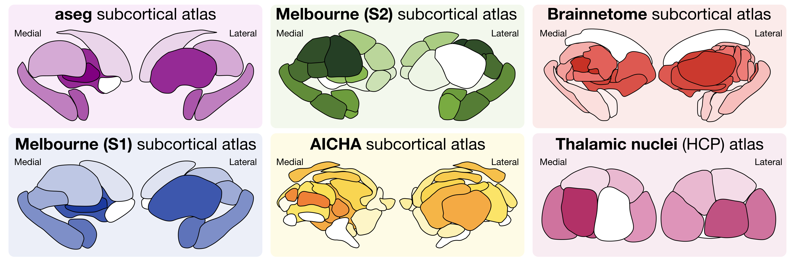

# Subcortex visualization software

Welcome to the documentation for subcortical visualization software!
This package is implemented in both Python (`subcortex_visualization`) and R (`subcortexVisualizationR`) and currently includes the following nine subcortical, thalamic, and cerebellar atlases for data visualization in two-dimensional vector graphics:

All code can be found in the corresponding [GitHub repository](https://github.com/anniegbryant/subcortex_visualization).

More information about these atlases, including the process of rendering the surfaces and tracing the outlines for each, can be found in the [Atlas information](https://anniegbryant.github.io/subcortex_visualization/atlas_info/) directory.