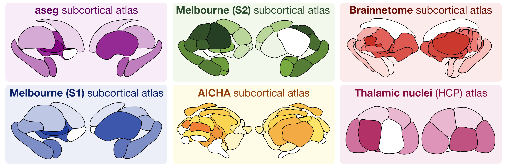

# Subcortex visualization software

Welcome to the documentation for subcortical visualization software!
This python package currently includes the following six subcortical atlases for data visualization in two-dimensional vector graphics:

More information about these atlases, including the process of rendering the surfaces and tracing the outlines for each, can be found in the [`atlas_info/`](https://github.com/anniegbryant/subcortex_visualization/tree/main/atlas_info) directory.